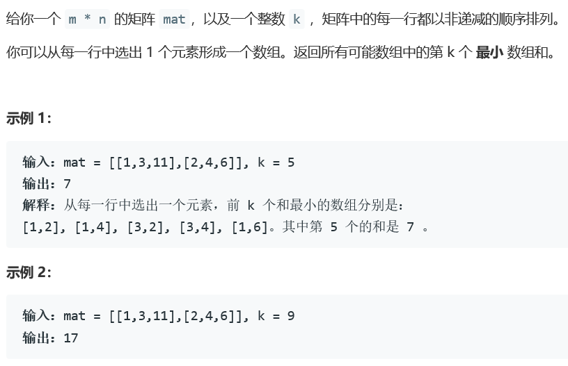
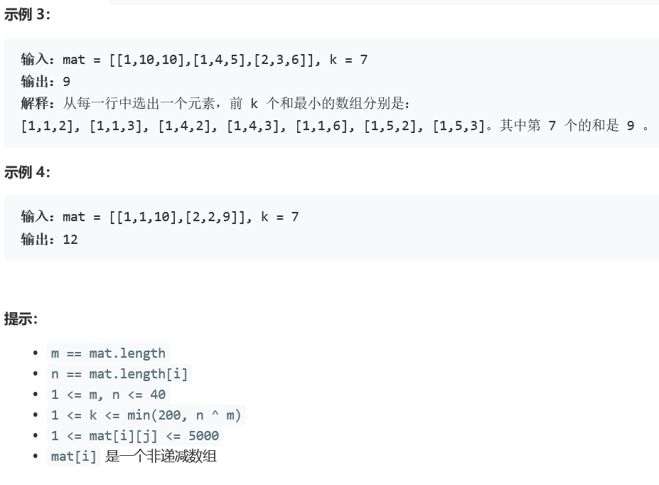

### 5394. 对角线遍历 II

  




## Java solution
```java
class Solution {
    public int kthSmallest(int[][] mat, int k) {
        int m=mat.length,n=mat[0].length;
        List<Integer> l=new ArrayList<>();
        for(int i=0;i<n;i++)l.add(mat[0][i]);
        for(int i=1;i<m;i++)
        {
            List<Integer> w=new ArrayList<>();
            for(int j=0;j<n;j++)
            {
                for(Integer num:l)
                {
                    w.add(num+mat[i][j]);
                }
            }
            Collections.sort(w);
            if(w.size()>k) 
            {
                l=new ArrayList<>();
                for(int t=0;t<k;t++)l.add(w.get(t));
            }
            else l=w;
        }
        return l.get(k-1);
    }
}
```