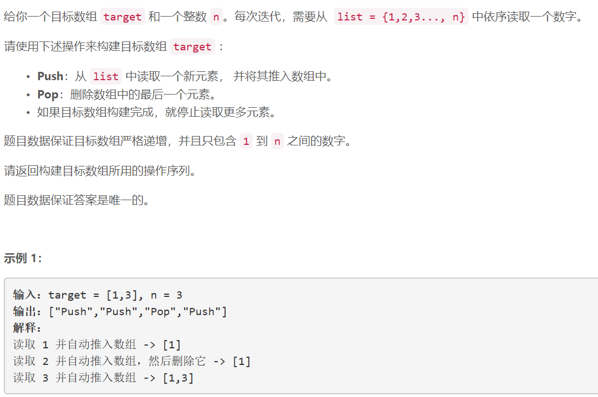
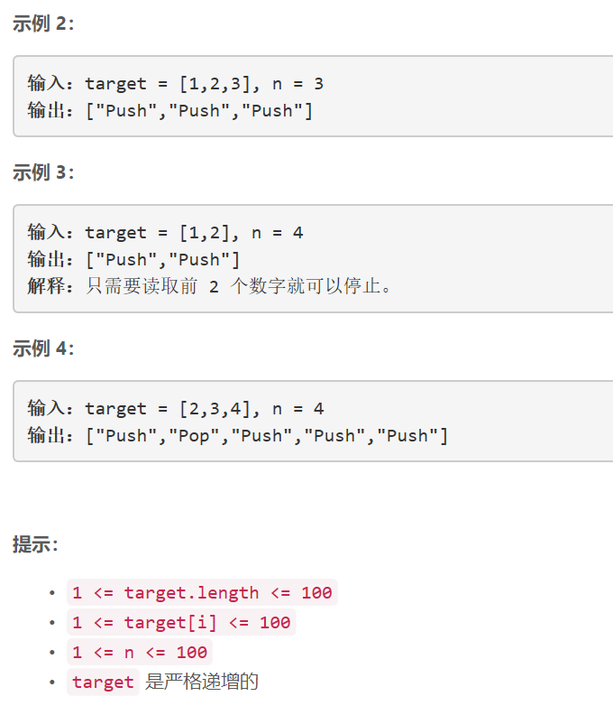

### 5404. 用栈操作构建数组

  

   


## Java solution
```java
class Solution {
    public List<String> buildArray(int[] target, int n) {
         List<String> res=new ArrayList<>();
         int len=target.length; 
         for(int i=0,num=1;i<len;)
         {
             if(target[i]>num)
             {
                 res.add("Push");
                 res.add("Pop");
                 ++num;
             }
             else
             {
                 res.add("Push");
                 ++num;
                 ++i;
             }
         }
        return res;
    }
}
```


