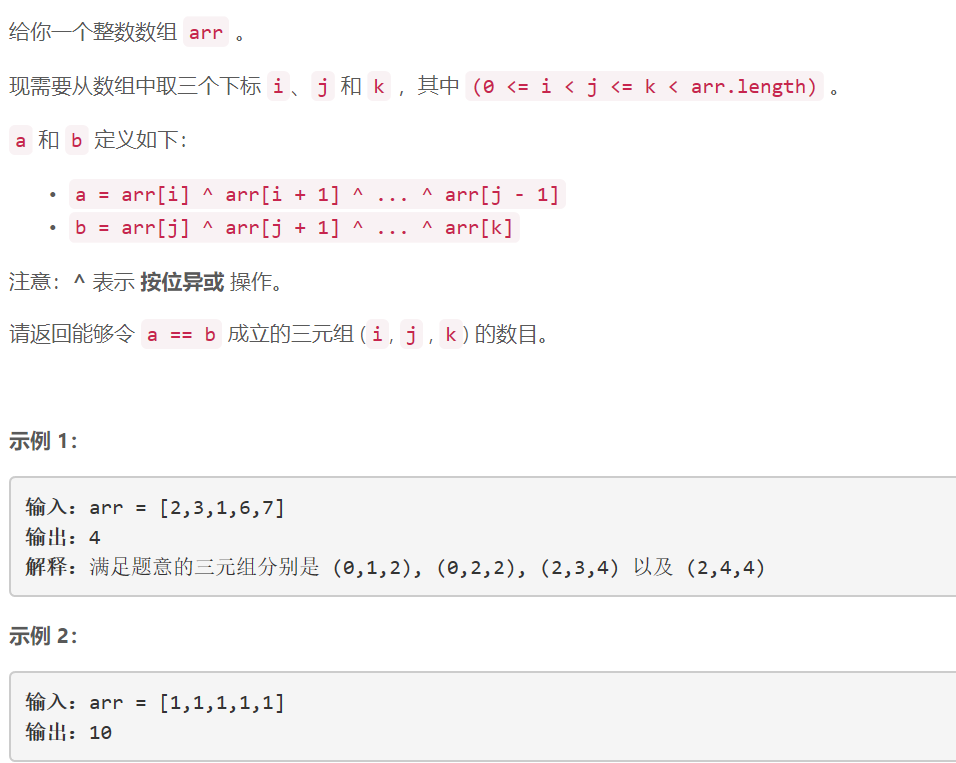
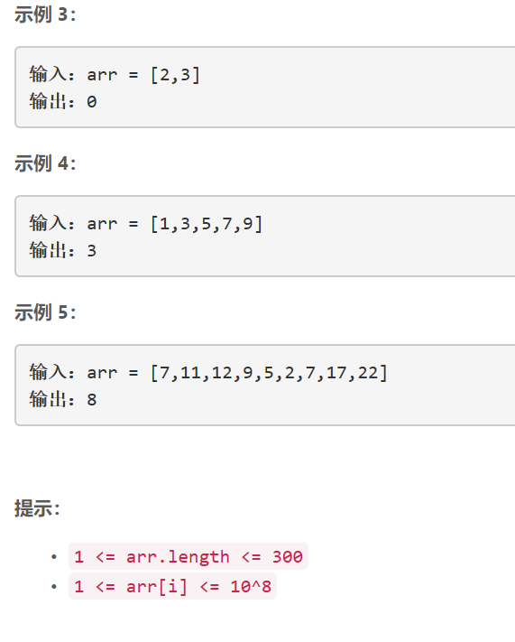

### 5402. 绝对差不超过限制的最长连续子数组


  

    

## Java solution
```java
class Solution {
    public int countTriplets(int[] arr) {
         int len=arr.length;
         if(len==1) return 0;
         int res=0;
         int[][] a=new int[len][len];  //a[i][j] 从i到j-1 j不取
         int[][] b=new int[len][len];  //b[j][k] 从j到k k取
         for(int i=0;i<len-1;i++)
         {
             a[i][i+1]=arr[i];
             for(int j=i+2;j<len;j++)
             {
                 a[i][j]=a[i][j-1]^arr[j-1];
             }
         }
         for(int j=1;j<len;j++)
         {
             b[j][j]=arr[j];
             for(int k=j+1;k<len;k++)
             {
                
                 b[j][k]=b[j][k-1]^arr[k];
             }
         }
         for(int i=0;i<len-1;i++)
         {
             for(int j=i+1;j<len;j++)
             {
                 for(int k=j;k<len;k++)
                 {
                     if(a[i][j]==b[j][k])
                     {
                         res++;
                     }
                 }
             }
         }

         return res;
    }
}

```