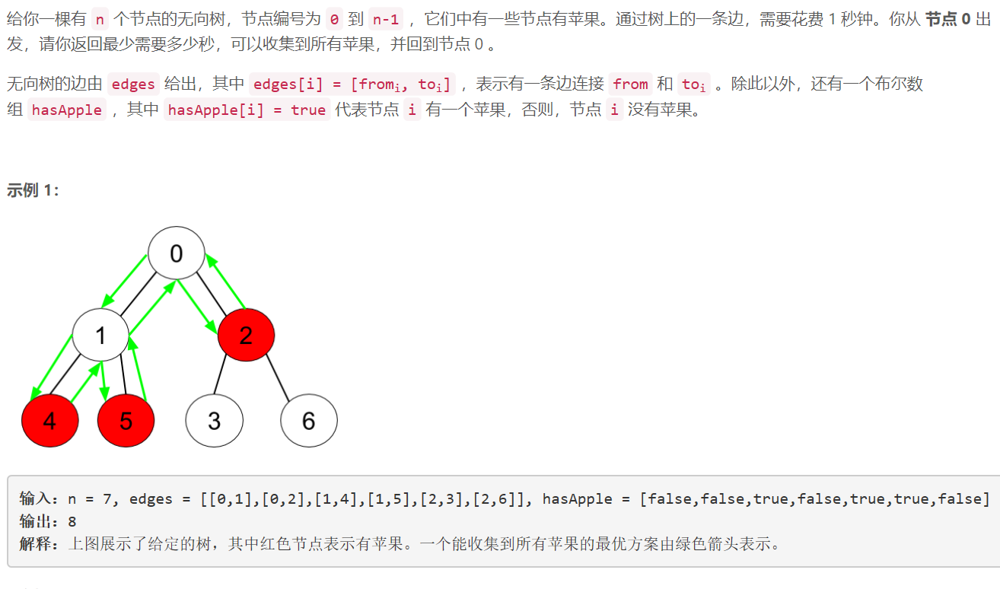
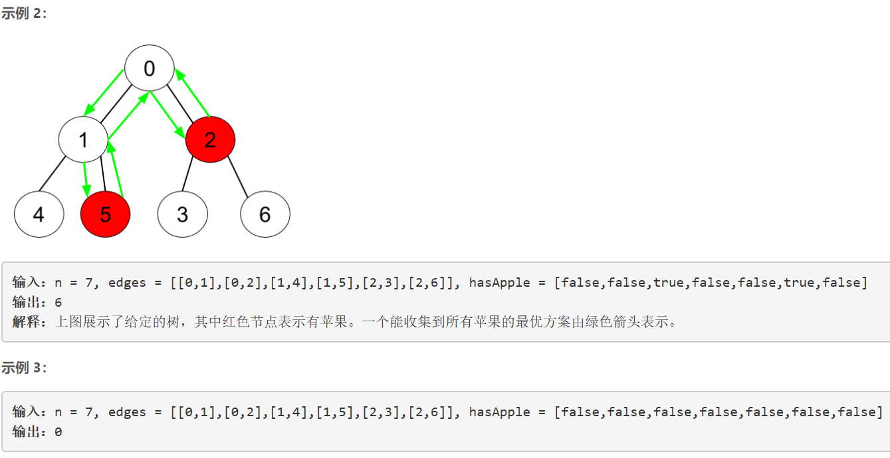
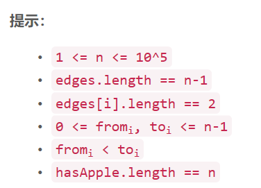

### 5406. 收集树上所有苹果的最少时间


    



  


## Java solution
```java
class Solution {
    int res=Integer.MAX_VALUE;
    List<Integer>[] e=new ArrayList[100005];//记录每个节点和其相连的节点 
    int[] nodeTime=new int[100005];//记录每个节点遍历其子节点所有苹果所需的时间
    public int minTime(int n, int[][] edges, List<Boolean> hasApple) {
        for(int i=0;i<n;i++)e[i]=new ArrayList<>();
        for(int i=0;i<n-1;i++)
        {
            e[edges[i][0]].add(edges[i][1]);
            e[edges[i][1]].add(edges[i][0]);
        }
        dfs(0,-1,hasApple);
        return nodeTime[0]==-1?0:nodeTime[0];
    }
    private void dfs(int cur,int pre,List<Boolean> hasApple)
    {
       nodeTime[cur]=-1;//当前节点如果孩子节点和自己都没有苹果 则将其对应时间置为-1
       if(hasApple.get(cur)) nodeTime[cur]=0;
       for(Integer next:e[cur])
       {
           if(next==pre)continue;//遍历当前和当前节点相连的所有节点 除了父节点
           dfs(next,cur,hasApple);
           if(nodeTime[next]!=-1)//如果孩子节点有苹果 则需要加上该节点遍历苹果时间 + 该节点和当前节点来回的时间2
           {
               nodeTime[cur]=nodeTime[cur]==-1?0:nodeTime[cur];
               nodeTime[cur]+=nodeTime[next]+2;
           }
       }
           
    }
}
```