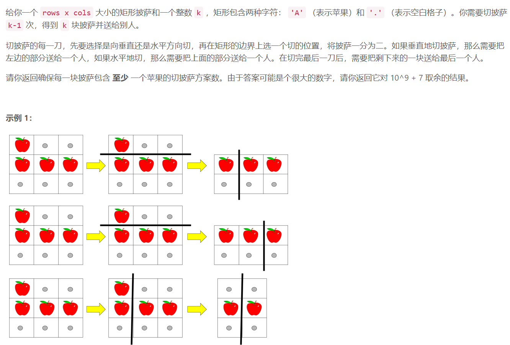
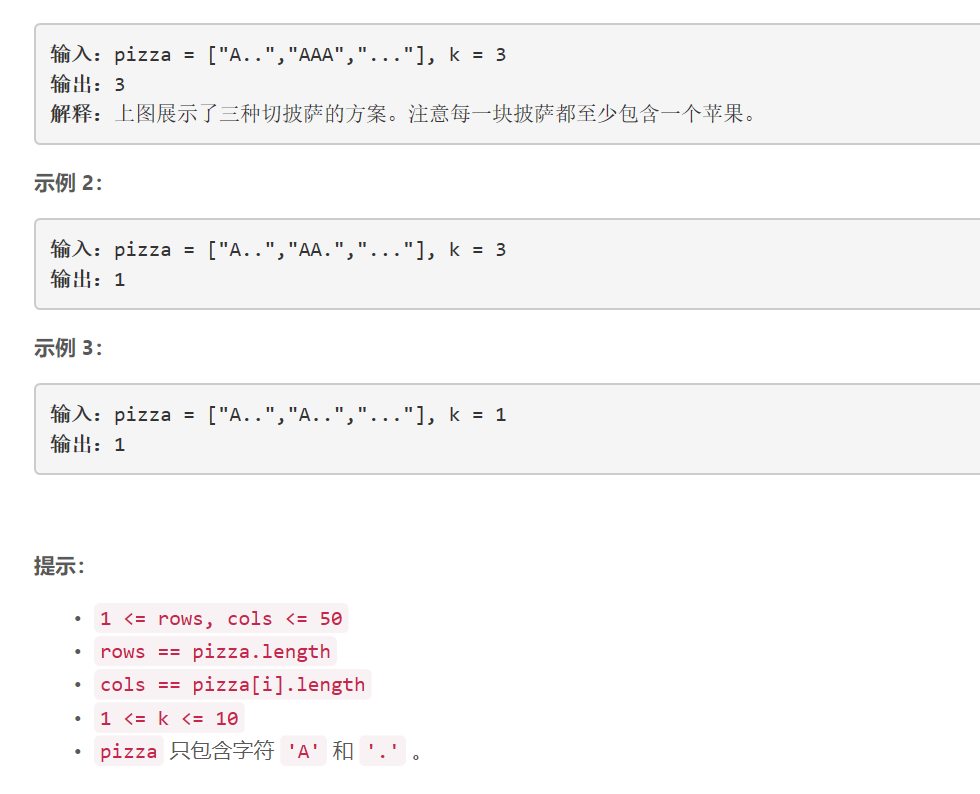

### 5407. 切披萨的方案数

  




## Java solution
```java
class Solution {
    int mod=(int)1e9+7;
    public int ways(String[] pizza, int k) {
        int row=pizza.length,col=pizza[0].length();
        boolean[][] piz=new boolean[row][col];
        for(int i=0;i<row;i++)
        {
            for(int j=0;j<col;j++)
            {
                piz[i][j]=pizza[i].charAt(j)=='.'?false:true;
            }
        }
        Integer[][][] dp=new Integer[row][col][k];//从第i行 第j列开始 分割k块披萨的方案数
        return dfs(dp,piz,0,0,k-1);
    }
    
    private int dfs(Integer[][][] dp,boolean[][] piz,int i,int j,int k)
    {
        int cnt=0;
        if(dp[i][j][k]!=null) return dp[i][j][k];//如果在之前计算中已经算过dp[i][j][k] 直接返回即可
        else if(!check(piz,i,piz.length,j,piz[0].length))return 0;//先检查当前剩余披萨有没有苹果 无苹果则方案不成立
        else if(k==0)return 1;//以只需一块披萨为例 输入k=0 如果当前这块披萨有苹果 那么返回方案数1 
        else 
        {
            //枚举所有可能分割
            for(int m=i+1;m<piz.length;m++)
            {
                if(check(piz,i,m,j,piz[0].length))
                {
                    cnt=(cnt+dfs(dp,piz,m,j,k-1))%mod;
                }
            }
            for(int n=j+1;n<piz[0].length;n++)
            {
                if(check(piz,i,piz.length,j,n))
                {
                    cnt=(cnt+dfs(dp,piz,i,n,k-1))%mod;
                }
            }
        }
        return dp[i][j][k]=cnt;
    }
    private boolean check(boolean[][] piz,int a,int b,int c,int d)
    {
        for(int i=a;i<b;i++)
        {
            for(int j=c;j<d;j++)
            {
                if(piz[i][j])return true;
            }
        }
        return false;
    }
}
```