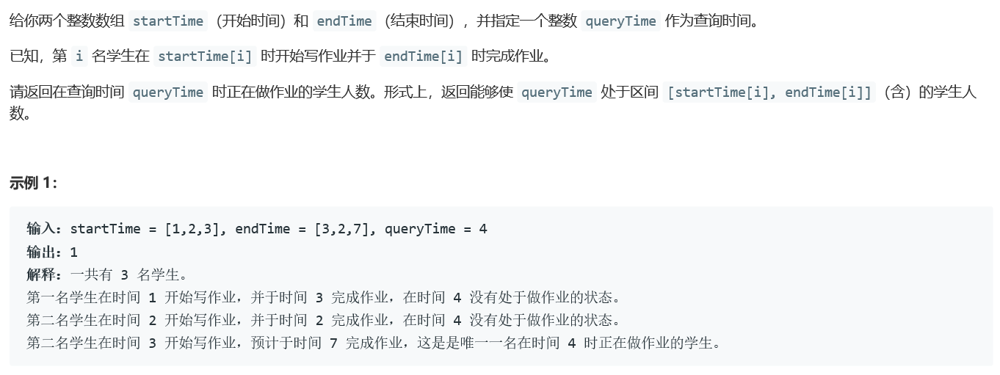

### 5412. 在既定时间做作业的学生人数

  

   


## Java solution

```java
class Solution {
    public int busyStudent(int[] startTime, int[] endTime, int queryTime) {
         int n=startTime.length;
         int cnt=0;
         for(int i=0;i<n;i++)
         {
             if(queryTime>=startTime[i] && queryTime<=endTime[i])++cnt;
         }
        return cnt;
    }
}
```


