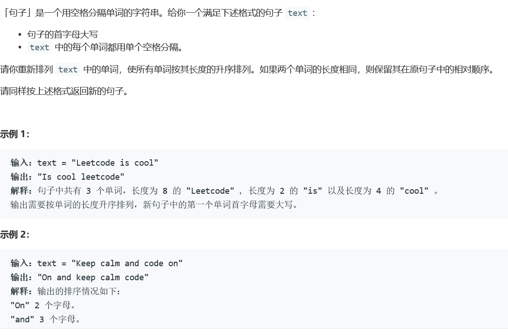
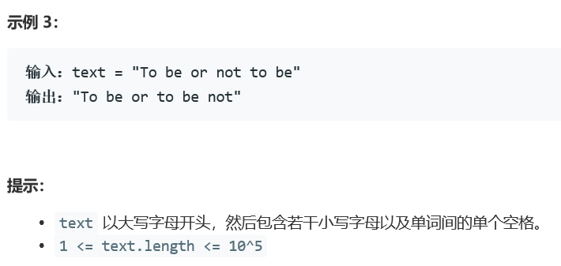

### 5413. 重新排列句子中的单词


    

  


## Java solution
```java
class Solution {
    public String arrangeWords(String text) {
         String[] words=text.split(" ");
         char[] first=words[0].toCharArray();
         first[0]+='a'-'A';
         words[0]= String.valueOf(first);  
         Arrays.sort(words,new SortByLengthComparator());
         String res="";
         first=words[0].toCharArray();
         if(first[0]-'A'>=26)  first[0]-='a'-'A';
         words[0]= String.valueOf(first);   
         for(int i=0;i<words.length;i++)
         {
             res+=words[i];
             if(i<words.length-1)res+=" ";
         }
        return res;
    }
}
public class SortByLengthComparator implements Comparator<String> 
{ 	
   @Override	
   public 
   int compare(String var1, String var2) 
   {		
     if (var1.length() > var2.length()) 
     {			
      return 1;		
     }
      else if (var1.length() == var2.length()) 
     {			
       return 0;		
     } else 
     {			
       return -1;		
     }	
    } 
  }
```