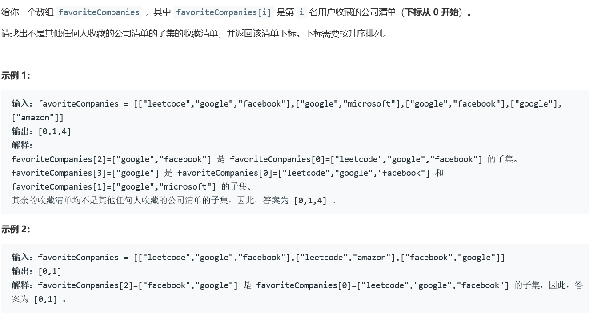
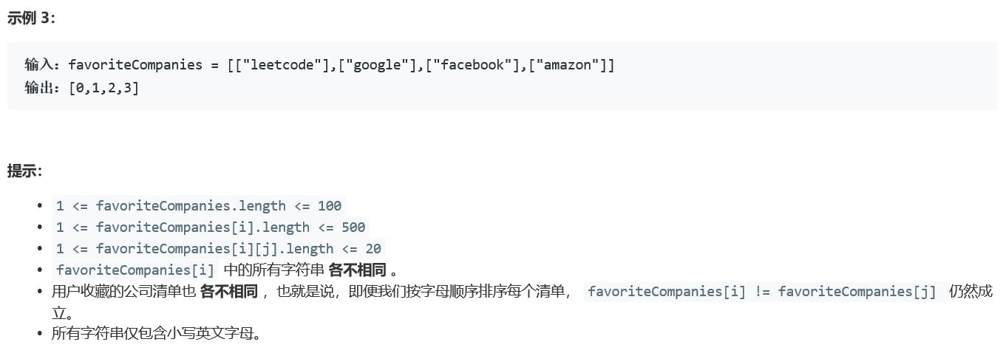

### 5414. 收藏清单

  




## Java solution
```java
class Solution {
    public List<Integer> peopleIndexes(List<List<String>> favoriteCompanies) {
        List<Set<Integer>> l=new ArrayList<>();
        int m=favoriteCompanies.size(),n=favoriteCompanies.get(0).size();
        HashMap<String,Integer> map=new HashMap<String,Integer>();
        List<Integer> res=new ArrayList<>();
        int cnt=0;
        for(int i=0;i<m;i++)
        {
            Set<Integer> cur=new HashSet<>();
            for(int j=0;j<favoriteCompanies.get(i).size();j++)
            {
                String s=favoriteCompanies.get(i).get(j);
                if(map.getOrDefault(s,-1)!=-1)
                {
                    cur.add(map.getOrDefault(s,-1));
                }
                else 
                {
                    map.put(s,cnt);
                    cur.add(cnt);
                    ++cnt;
                }
            }
            l.add(cur);
        }
        for(int i=0;i<m;i++)
        {
            Set<Integer> s1=l.get(i);
            boolean flag=false;
            for(int j=0;j<m;j++)
            {
                if(j==i)continue;
                Set<Integer> s2=l.get(j);
                if(isSubset(s1,s2))
                {
                    flag=true;
                    break;
                }
            }
            if(!flag)res.add(i);
        }
        return res;
    }
    private boolean isSubset(Set<Integer> s1,Set<Integer> s2)
    {
        if(s1.size()>s2.size()) return false;
        for(Integer num:s1)
        {
            if(!s2.contains(num)) return false;
        }
        return true;
    }
}
```