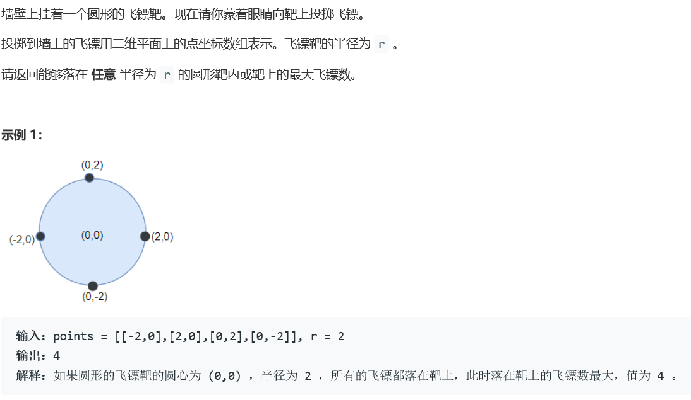
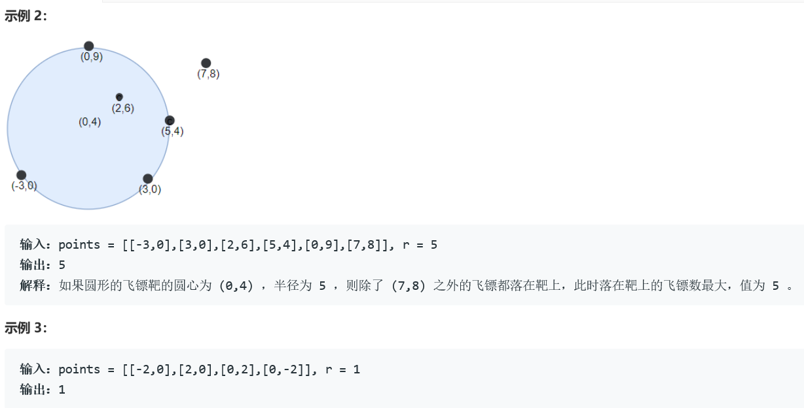
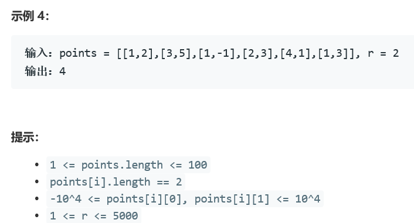

### 5415. 圆形靶内的最大飞镖数量


  

    



## Java solution

```java
class Solution {
    double diff=1e-8;
    //44ms 37.6MB
    //已知两点坐标和半径求圆心坐标，然后遍历points，所有到圆心距离小于半径的都满足条件。
    public int numPoints(int[][] points, int r) {
       int n=points.length;
       int res=1;
       double r2=square(r);
       for(int i=0;i<n;i++)
       {
           for(int j=i+1;j<n;j++)
           {
               double x1=points[i][0];
               double x2=points[j][0];
               double y1=points[i][1];
               double y2=points[j][1];
               double x3=(x1+x2)/2;
               double y3=(y1+y2)/2;
               double q=Math.sqrt(square(x1-x2)+square(y1-y2));
               double a=Math.sqrt(r2-square(q/2));
               double diffx=a*(y2-y1)/q;
               double diffy=a*(x1-x2)/q;
               double centerx1=x3+diffx;
               double centery1=y3+diffy;
               double centerx2=x3-diffx;
               double centery2=y3-diffy;
               int cnt1=count(points,r2,centerx1,centery1);
               int cnt2=count(points,r2,centerx2,centery2);
               res=Math.max(Math.max(cnt1,cnt2),res);
           }
       }
       return res;
    }
    public int count(int[][] points,double r2,double x,double y)
    {
        int cnt=0;
        for(int i=0;i<points.length;i++)
        {
            if(square(x-points[i][0])+square(y-points[i][1])<=r2+diff)cnt++;
        }
        return cnt;
    }
    double square(double num)
    {
        return num*num;
    }
}

```