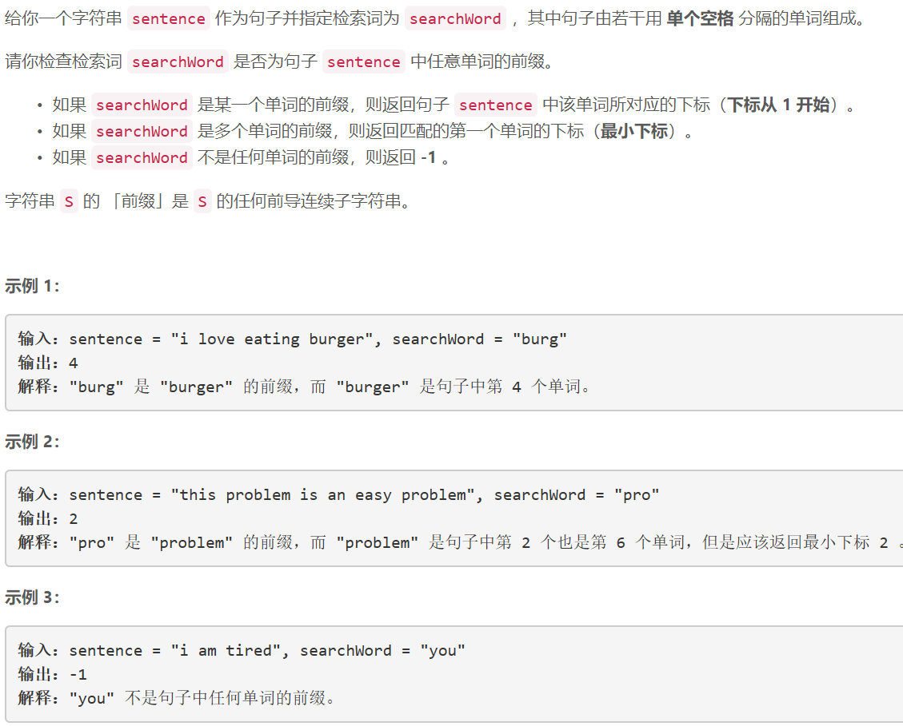
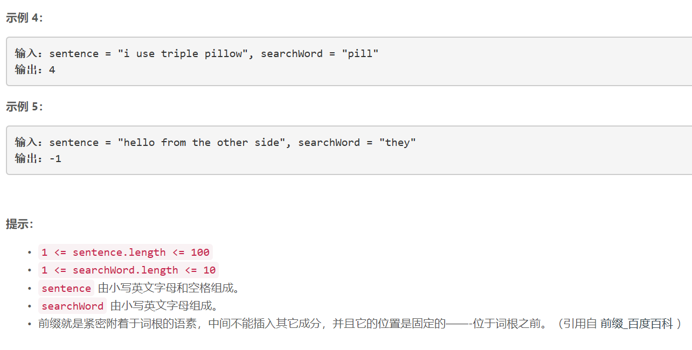

### 5416. 检查单词是否为句中其他单词的前缀

  

   

## Java solution

```java
class Solution {
    public int isPrefixOfWord(String sentence, String searchWord) {
           String[] str=sentence.split(" ");
           for(int i=0;i<str.length;i++)
           {
               if(check(str[i],searchWord))return i+1;
           }
        return -1;
           
    }
    public boolean check(String s1,String s2)
    {
        int n1=s1.length(),n2=s2.length();
        if(n1<n2) return false;
        for(int i=0;i<n2;i++)if(s1.charAt(i)!=s2.charAt(i))return false;
        return true;
    }
}
```


