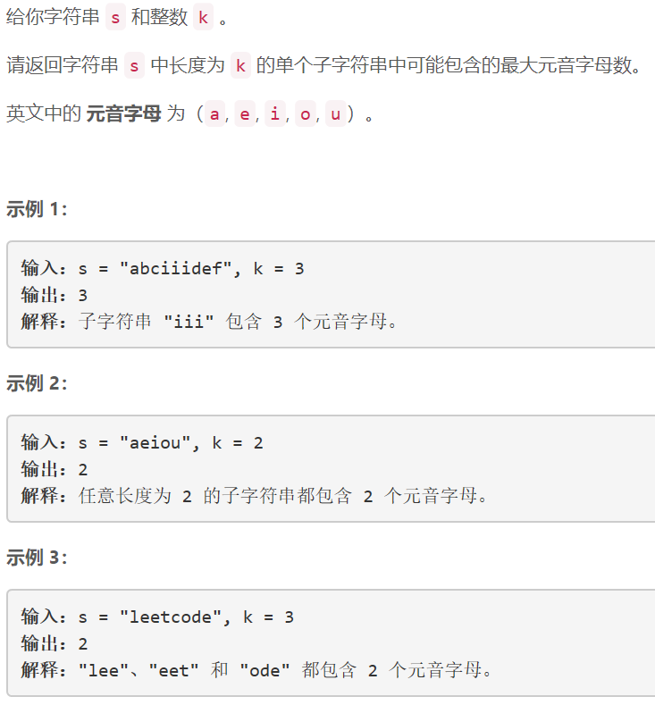
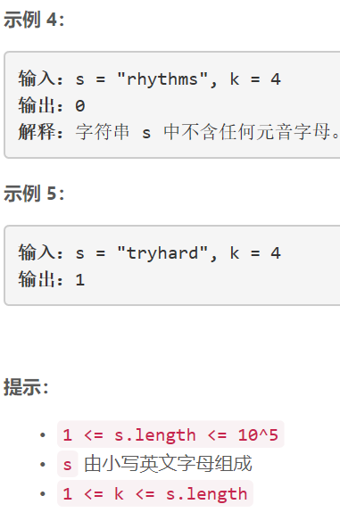

### 5417. 定长子串中元音的最大数目


    

  


## Java solution
```java
class Solution {
    public int maxVowels(String s, int k) {
        char[] yuanyin={'a','e','i','o','u'};
        char[] str=s.toCharArray();
        Set<Character> set=new HashSet<>();
        Queue<Character> q=new LinkedList<>();
        for(char c:yuanyin)set.add(c);
        int cur=0,res=0;
        for(int i=0;i<str.length;i++)
        {
            if(i<k)
            {
                if(set.contains(str[i]))cur++;
                q.offer(str[i]);
            }
            else
            {
                res=Math.max(res,cur);
                char c=q.poll();
                int num1=set.contains(c)?-1:0;
                int num2=set.contains(str[i])?1:0;                     
                cur+= num1+num2;
                q.offer(str[i]);
            }
        }
        res=Math.max(res,cur);
        return res;
    }
}
```