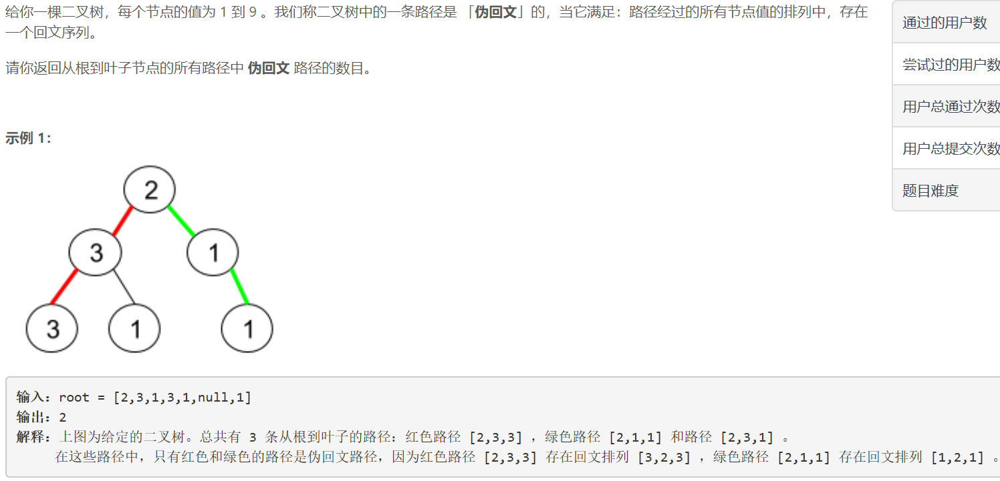
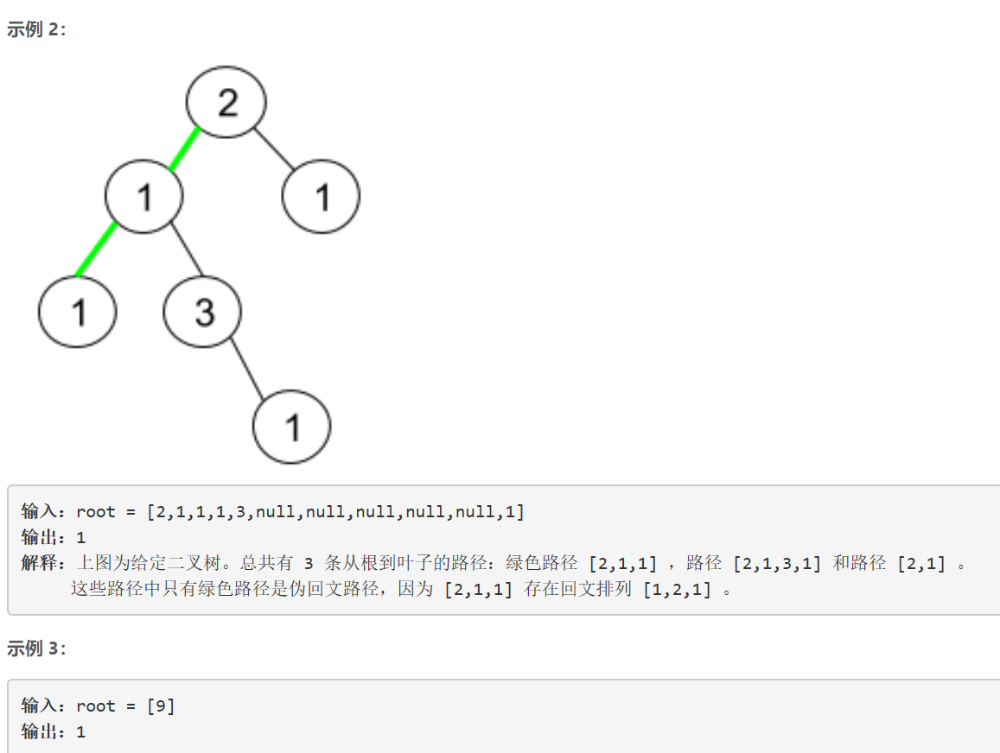

### 5418. 二叉树中的伪回文路径

  




## Java solution
```java
/**
 * Definition for a binary tree node.
 * public class TreeNode {
 *     int val;
 *     TreeNode left;
 *     TreeNode right;
 *     TreeNode() {}
 *     TreeNode(int val) { this.val = val; }
 *     TreeNode(int val, TreeNode left, TreeNode right) {
 *         this.val = val;
 *         this.left = left;
 *         this.right = right;
 *     }
 * }
 */
class Solution {
    int res=0;
    public int pseudoPalindromicPaths (TreeNode root) {
        dfs(root,new ArrayList<>());
        return res;
    }
    public void dfs(TreeNode root,List<Integer> path)
    {
        if(root==null) return;
        int n=path.size();
        List<Integer> list=new ArrayList<>(path);
        list.add(root.val);
        if(root.left==null && root.right==null)
        {
            if(check(list))++res;
            return;
        }
        dfs(root.left,list);
        dfs(root.right,list);
        
    }
    public boolean check(List<Integer> list)
    {
        int n=list.size();
        HashMap<Integer,Integer> map=new HashMap<>();
        for(Integer num:list)
        {
            int cnt=map.getOrDefault(num,0);
            
            map.put(num,cnt+1);
        }
        int cnt=0;
        for(Integer key:map.keySet())
        {
            if(map.get(key)%2==1) cnt++;
            if(cnt>1) return false;
        }
        return true;
    }

}
```