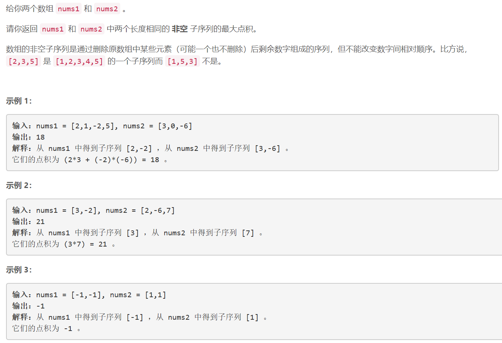
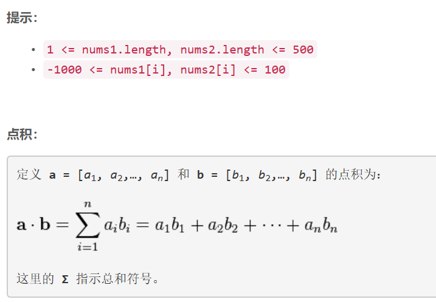

### 5419. 两个子序列的最大点积


  

    

## Java solution

```java
class Solution {
    public int maxDotProduct(int[] nums1, int[] nums2) {
        int n1=nums1.length,n2=nums2.length;
        int[][] dp=new int[n1][n2];//dp[i][j] 表示nums1.substr(0,i+1) 和nums2.substr(0,j+1) 能构成的最大子序列乘积
        dp[0][0]=nums1[0]*nums2[0];
        for(int i=1;i<n1;i++) dp[i][0]=Math.max(nums1[i]*nums2[0],dp[i-1][0]);
        for(int j=1;j<n2;j++) dp[0][j]=Math.max(nums1[0]*nums2[j],dp[0][j-1]);
        for(int i=1;i<n1;i++)
        {
            for(int j=1;j<n2;j++)
            {
                //dp[i][j] 的取值有4种情况
                int max1=Math.max(dp[i-1][j],dp[i][j-1]);
                int max2=Math.max(dp[i-1][j-1]+nums1[i]*nums2[j],nums1[i]*nums2[j]);
                dp[i][j]=Math.max(max1,max2);
            }
        }
        return dp[n1-1][n2-1];
    }
}

```