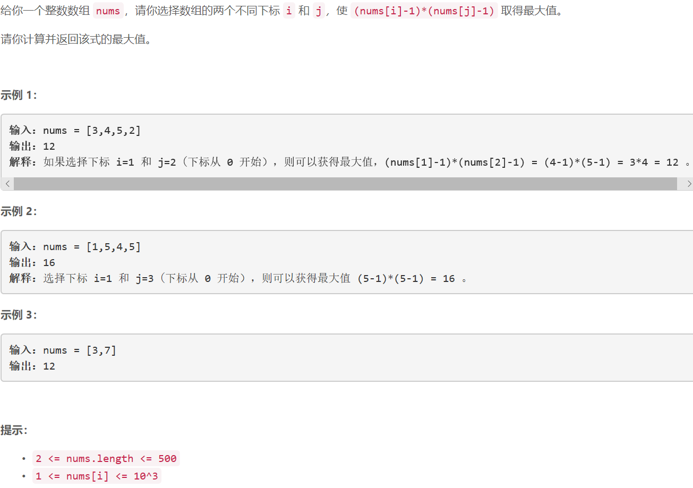

### \5424. 数组中两元素的最大乘积

     

## Java solution

```java
class Solution {
    public int maxProduct(int[] nums) {
        int res=0;
        for(int i=0;i<nums.length;i++)
        {
            for(int j=i+1;j<nums.length;j++)
            {
                int num=(nums[i]-1)*(nums[j]-1);
                res=Math.max(num,res);

            }
        }
        return res;
    }
}
```


