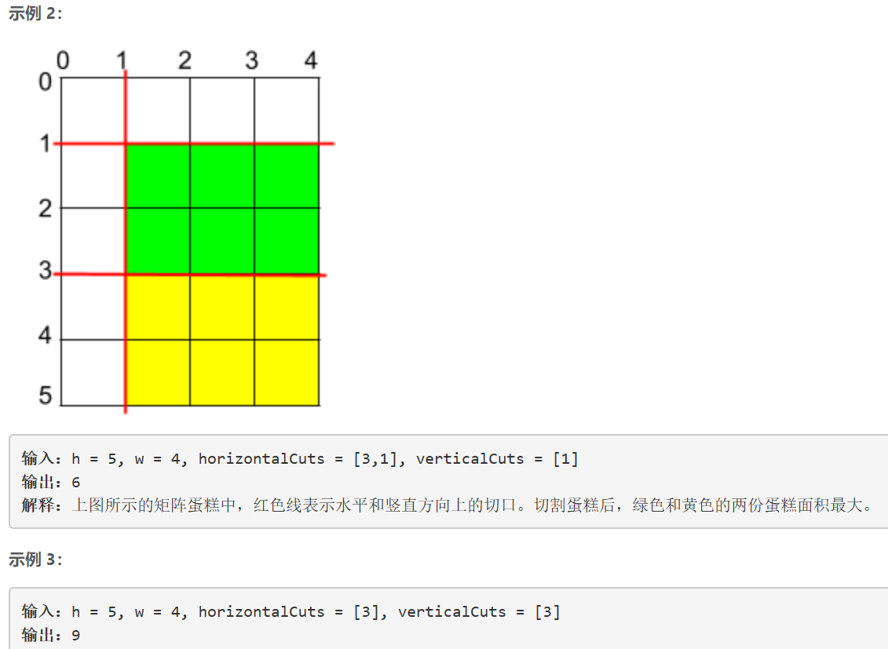

### 5425. 切割后面积最大的蛋糕


    



  


## Java solution
```java
class Solution {
    long MOD=(long)1e9+7;
    public int maxArea(int h, int w, int[] horizontalCuts, int[] verticalCuts) {
        int len1=horizontalCuts.length,len2=verticalCuts.length;
        int pre_h=0,pre_v=0;
        Arrays.sort(horizontalCuts);
        Arrays.sort(verticalCuts);
        int max_height=0,max_width=0;
        for(int i=0;i<len1;i++)
        {
            max_height=Math.max(max_height,horizontalCuts[i]-pre_h);
            pre_h=horizontalCuts[i];
        }
        max_height=Math.max(max_height,h-pre_h);
        for(int i=0;i<len2;i++)
        {
            max_width=Math.max(max_width,verticalCuts[i]-pre_v);
            pre_v=verticalCuts[i];
        }
        max_width=Math.max(max_width,w-pre_v);
        long m1=max_height,m2=max_width;//int直接相乘会溢出 需要先转换为long
        return (int)(m1*m2%MOD);

    }
}
```