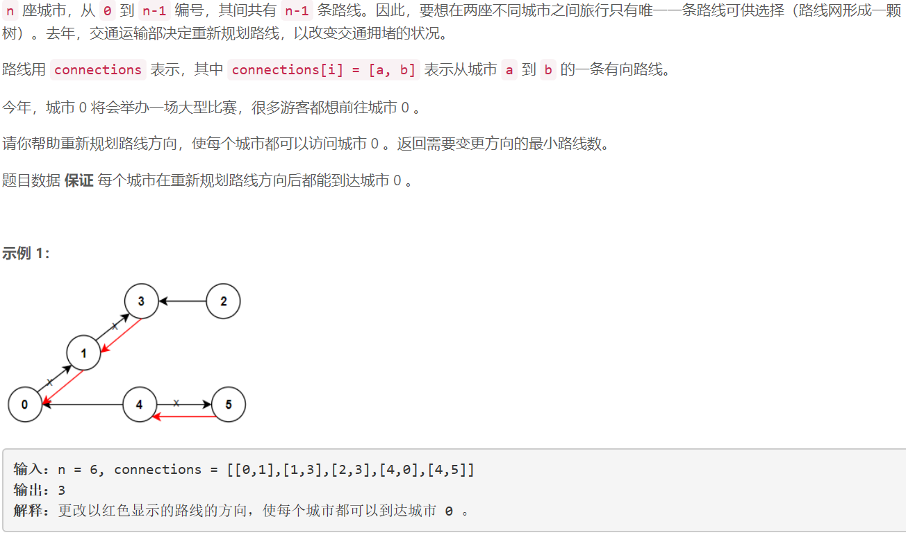
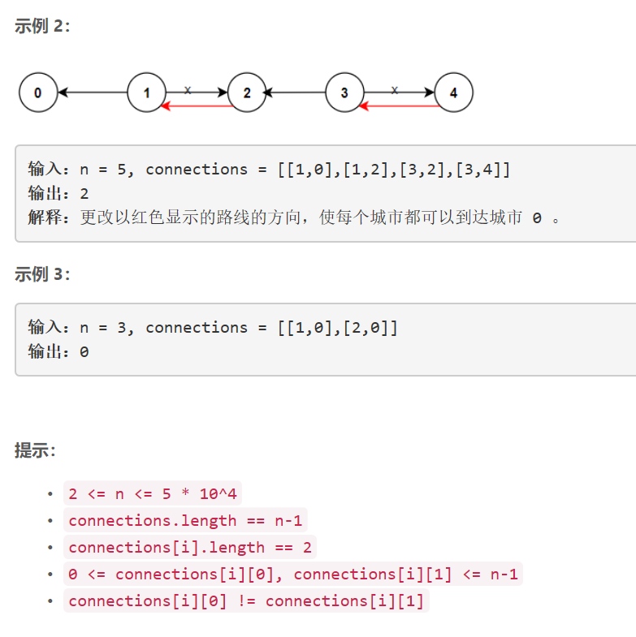

### 5426. 重新规划路线

  




## Java solution
```java
class Solution {
    List<List<Integer>> l1=new ArrayList<>();
    List<List<Integer>> l2=new ArrayList<>();
    int res=0;
    public int minReorder(int n, int[][] connections) {
        int len=connections.length;
        for(int i=0;i<n;i++) l1.add(new ArrayList<>());
        for(int i=0;i<n;i++) l2.add(new ArrayList<>());
        for(int i=0;i<len;i++)
        {
            l1.get(connections[i][0]).add(connections[i][1]);
            l2.get(connections[i][1]).add(connections[i][0]);
        }
        dfs(0,new boolean[n]);
        return res;
    }
    private void dfs(int idx,boolean[] visited)
    {
        visited[idx]=true;
        for(Integer num:l1.get(idx))
        {
            if(visited[num])continue;
            res++;
            dfs(num,visited);
        }
        for(Integer num:l2.get(idx))
        {
            if(visited[num])continue;
            dfs(num,visited);
        }
    }
}
```