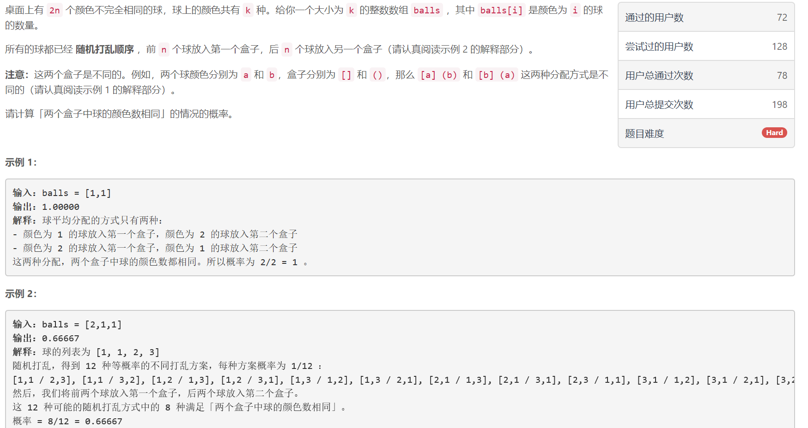
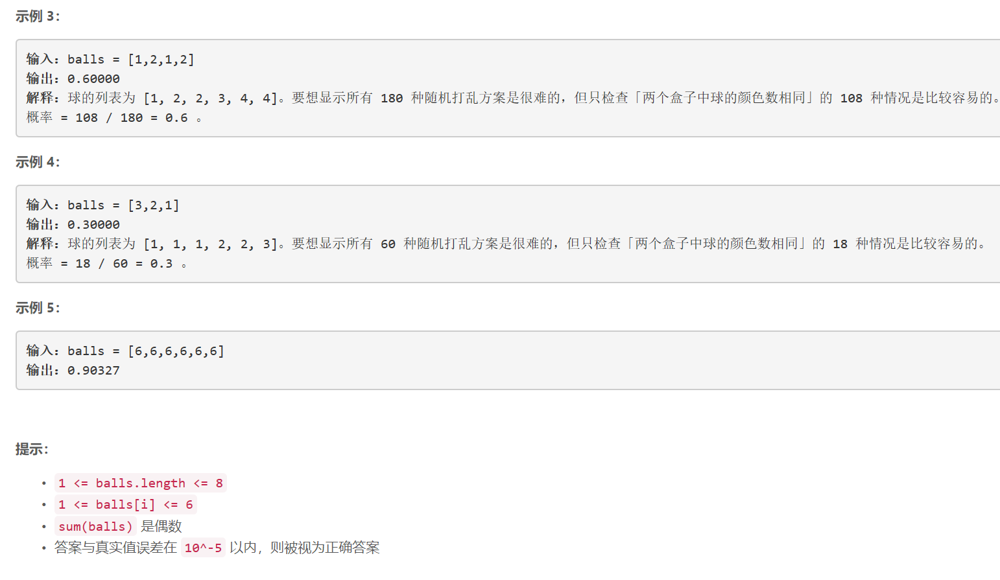

### 5427. 两个盒子中球的颜色数相同的概率


  

    

[]: https://leetcode-cn.com/problems/probability-of-a-two-boxes-having-the-same-number-of-distinct-balls/solution/c-dfs-zu-he-shu-xue-si-lu-dai-ma-by-lhrst/	"题解"


## Java solution

```java
class Solution {
    int[] left=new int[10];//剩余的球的数目 
    double[] frac=new double[15];//算阶乘，用于计算组合数
    double[] pow=new double[15];
    int len=0;
    int n=0;//一共有多少个球，用于最后的除法
    public double getProbability(int[] balls) {
        len=balls.length;
        for(int i=0;i<len;i++)n+=balls[i];
        for(int i=0;i<15;i++) pow[i]=1<<i;
        calFactorial();
        double p1=1;//计算出C(2n, n)/2^(2n)，即满足左n右n的概率
        n=n/2;
        for(int i=1;i<=n;i++)p1*= (n+i)*1.0/i/4;
        left[len-1]=balls[len-1];
        for(int i=len-2;i>=0;i--)left[i]=balls[i]+left[i+1];//计算剩余球数，用于剪枝
        double p2=dfs(balls,0,0,0);
        return p2/p1;
    }
    private void calFactorial()
    {
        frac[0]=1;
        for(int i=1;i<15;i++)
        {
            frac[i]=frac[i-1]*i;
        }
    }
    private double combination(int a,int b)
    {
        return frac[a]/frac[b]/frac[a-b];
    }
    //深搜函数，balls是题目给的数组，m代表当前搜索颜色m，greatersum是左边的箱子比右边箱子多几个球，greatercolor是左边比右边多几种颜色
    private double dfs(int[] balls,int m,int greatersum,int greatercolor)
    {
        if(m==len)//只有左边右边球的数量和颜色种类的数量相等时才算，否则免谈
        {
            return greatersum==0 && greatercolor==0?1.0:0.0;
        }
        //剪枝，假设目前还剩余x个球没有分配，但是左边比右边的球多的数量，
        //或者右边箱子比左边箱子多出的球的数量大于x，那么我们无论怎么分配，都不可能在最后满足左右球的数量相等这个条件，所以剪枝
        if(Math.abs(greatersum)>left[m]) return 0.0;
        double res=0.0;
         //计算取不同数量的球放在左边，最后满足条件的概率
        res+=dfs(balls,m+1,greatersum-balls[m],greatercolor-1)/pow[balls[m]];
        for(int i=1;i<balls[m];i++)
        {
            res+=combination(balls[m],i)*dfs(balls,m+1,greatersum+i-(balls[m]-i),greatercolor)/pow[balls[m]];
        }
        res+=dfs(balls,m+1,greatersum+balls[m],greatercolor+1)/pow[balls[m]];
        return res;
    }
}

```