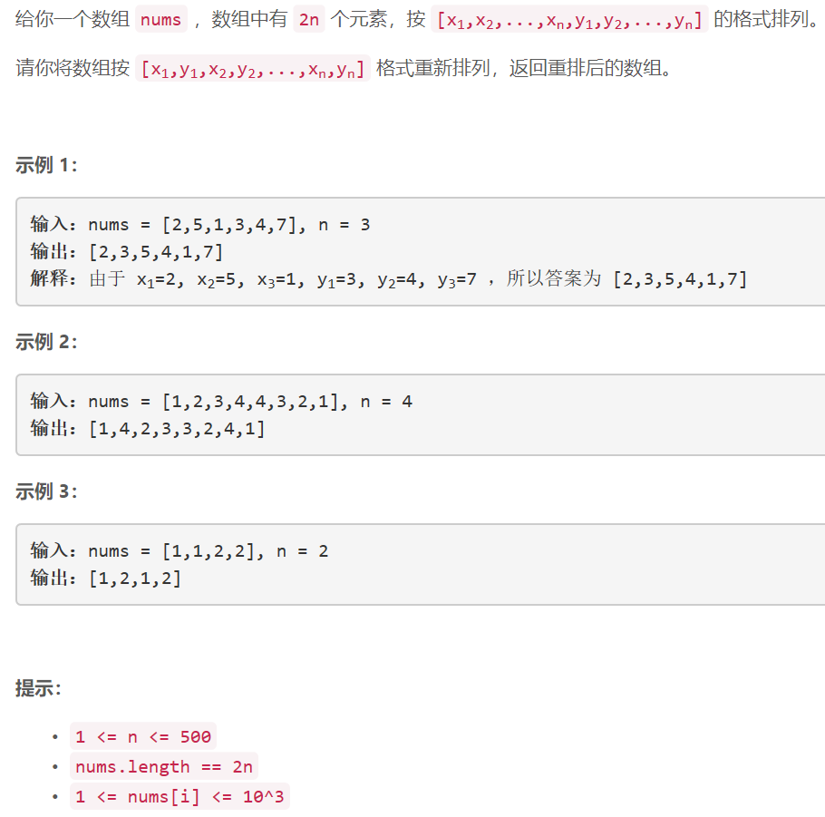

### 5428. 重新排列数组

     

## Java solution

```java
class Solution {
    public int[] shuffle(int[] nums, int n) {
       int[] res=new int[2*n]; 
        int j=0;
       for(int i=0;i<2*n;i+=2)
       {
           res[i]=nums[j];
           res[i+1]=nums[j+n];
           ++j;
       }
       return res;
    }
}
```


