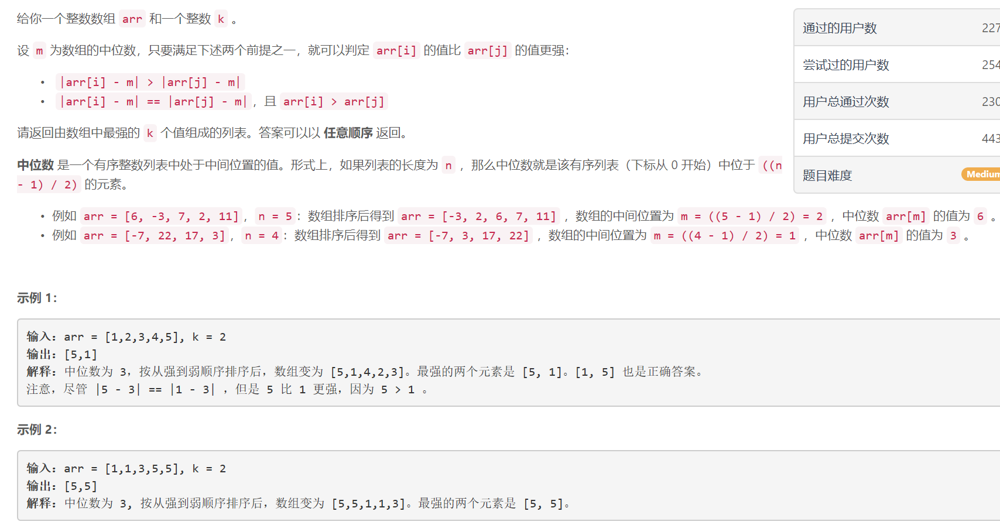
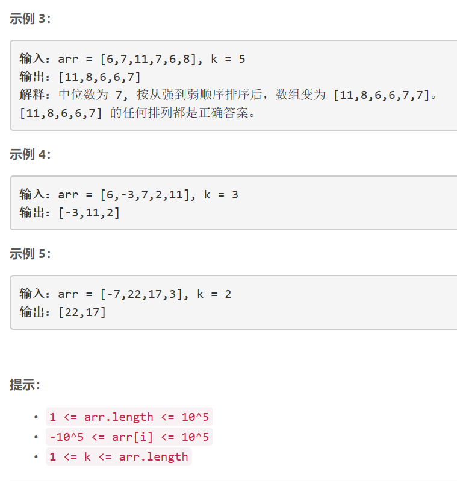

### 5429. 数组中的 k 个最强值


    




## Java solution
```java
class Solution {
    public int[] getStrongest(int[] arr, int k) {
         int n=arr.length;
         Arrays.sort(arr);
         List<Item> items=new ArrayList<>();
         int m=arr[(n-1)/2];
         Comparator<Item> comparator = new Comparator<Item>(){
          @Override
          public int compare(Item s1, Item s2) {
        
            
            if(s1.value < s2.value || (s1.value==s2.value && s1.origin<s2.origin)) return 1;
            else return -1 ;  
             }
         };

         for(int i=0;i<n;i++)
         {
             int origin=arr[i];
             Item item=new Item(origin,(int)Math.abs(origin-m));
             items.add(item);
         }
        Collections.sort(items,comparator); 
        int[] res=new int[k];
        for(int i=0;i<k;i++)
        {
            res[i]=items.get(i).origin;
        }
        return res;
    }
}

class Item
{
    int origin;
    int value;
    public Item(int origin,int value)
    {
        this.origin=origin;
        this.value=value;
    }
}
```