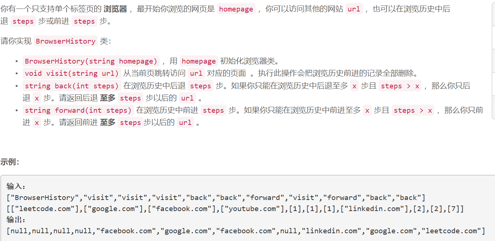
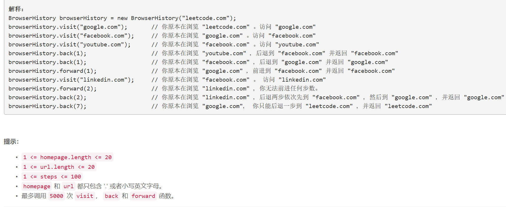

### 5430. 设计浏览器历史记录

  




## Java solution
```java
class BrowserHistory {
    List<String> s=new ArrayList<>();
    int pos=-1;
    public BrowserHistory(String homepage) {
        s.add(homepage);
        pos=0;
    }
    
    public void visit(String url) {
        //if(pos<0) return;
        while(!s.get(pos).equals(s.get(s.size()-1)))s.remove(s.size()-1);
        s.add(url);
        pos++;
    }
    
    public String back(int steps) {
        pos= pos-steps<0 ? 0:pos-steps;
        return s.get(pos);
    }
    
    public String forward(int steps) {
        pos=pos+steps>s.size()-1 ? s.size()-1:pos+steps;
        return s.get(pos);

    }
}

/**
 * Your BrowserHistory object will be instantiated and called as such:
 * BrowserHistory obj = new BrowserHistory(homepage);
 * obj.visit(url);
 * String param_2 = obj.back(steps);
 * String param_3 = obj.forward(steps);
 */
```