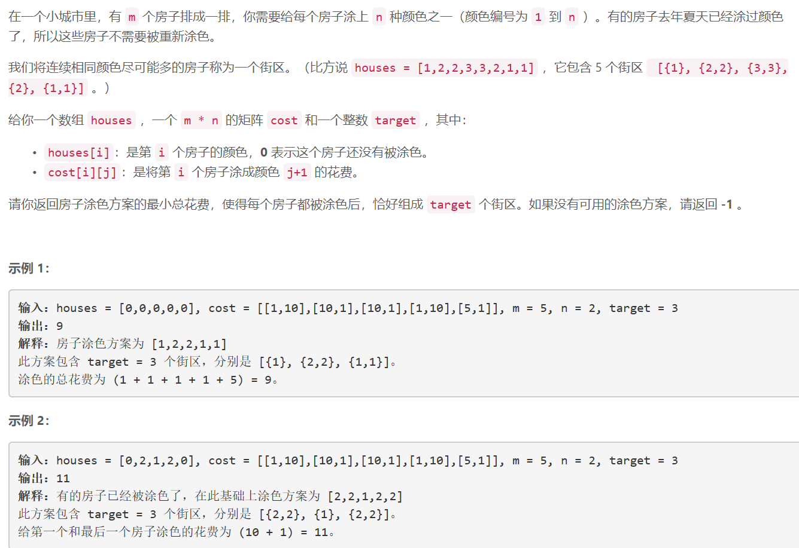
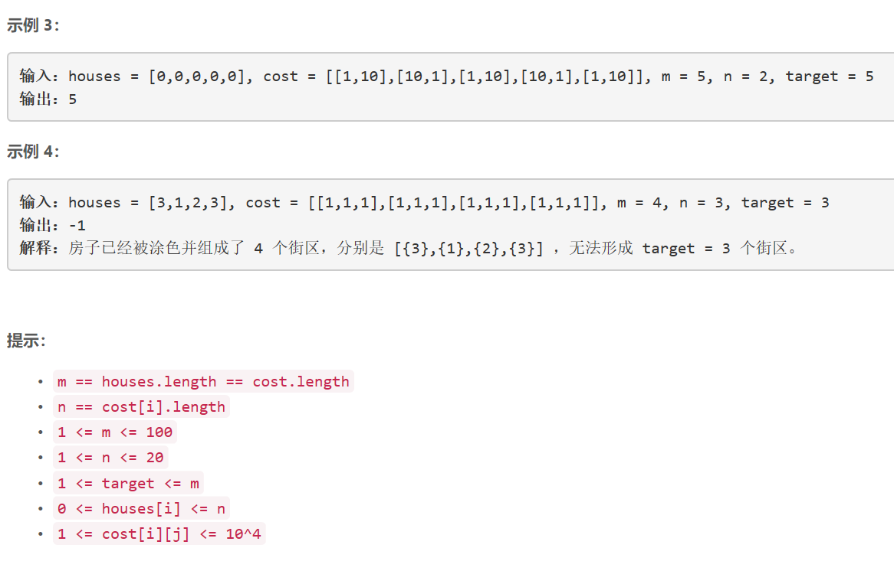

### 5431. 给房子涂色 III


  

    

## Java solution

```java
class Solution {
     int[][][] dp=new int[105][25][105]; //dp[i][j][k]将 前i个房子分成k个街区 同时第i个房子的颜色为j的最小花费
    public int minCost(int[] houses, int[][] cost, int m, int n, int target) {
        for(int i=0;i<105;i++)
        {
            for(int j=0;j<25;j++)
            {
                for(int k=0;k<105;k++)
                {
                   dp[i][j][k]=1<<30;
                }
            }
        }
        dp[0][0][0]=0;
        for(int i=0;i<m;i++)//i+1 位置处
        {
            for(int j=0;j<=n;j++)//i位置处的颜色为j+1
            {
                for(int k=0;k<=i;k++)//能分成k个街区 街区数不可能大于房子数
                {
                     if(houses[i]==0)
                     {
                         for(int t=1;t<=n;t++) //i+1处填充颜色为t
                         {
                             if(t!=j)//i位置和i+1位置颜色不相同 i+1处开始一个新街区
                             {
                                 dp[i+1][t][k+1]=Math.min(dp[i+1][t][k+1],dp[i][j][k]+cost[i][t-1]);
                             }
                             else//i位置和i+1位置颜色相同 保持为同一个街区
                             {
                                dp[i+1][t][k]=Math.min(dp[i+1][t][k],dp[i][j][k]+cost[i][t-1]);
                             }
                         }
                     }                    
                    else
                    {
                        if(houses[i]!=j)//i位置和i+1位置颜色不相同 i+1处开始一个新街区
                        {
                           dp[i+1][houses[i]][k+1]=Math.min(dp[i+1][houses[i]][k+1],dp[i][j][k]);
                        }
                        else//i位置和i+1位置颜色相同 保持为同一个街区
                        {
                           dp[i+1][houses[i]][k]=Math.min(dp[i+1][houses[i]][k],dp[i][j][k]);
                        }
                    }
                }
            }
        }
        int res=1<<30;
        for(int j=1;j<=n;j++) res=Math.min(res,dp[m][j][target]);
        return res==1<<30?-1:res;
    }
}

```