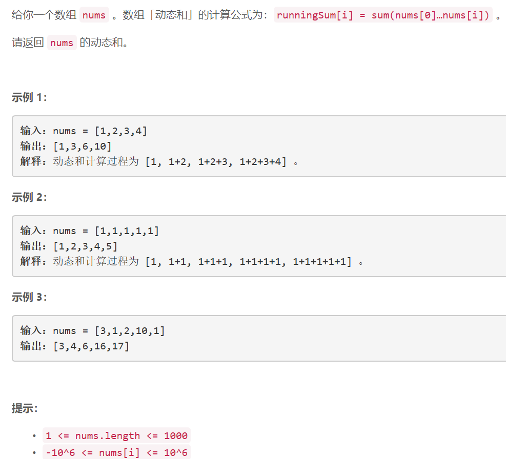

### 5428. 重新排列数组

     

## Java solution

```java
class Solution {
    public int[] runningSum(int[] nums) {
        int n=nums.length;
        int[] sum=new int[n];
        sum[0]=nums[0];
        for(int i=1;i<n;i++)sum[i]=sum[i-1]+nums[i];
        return sum;
    }
}
```


