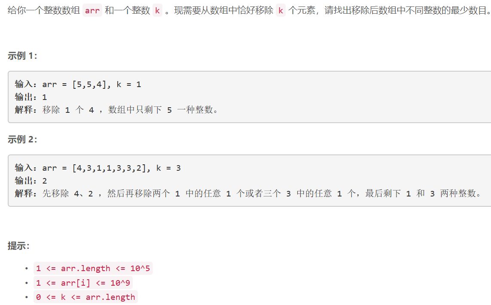

### 1481. 不同整数的最少数目


    


## Java solution
```java
class Solution {
    public int findLeastNumOfUniqueInts(int[] arr, int k) {
          int n=arr.length;
          Arrays.sort(arr);
          List<MyNum> nums=new ArrayList<>();
          int i=0; 
          while(i<n)
          {
              int cnt=1;
              while(i+1<n && arr[i+1]==arr[i])
              {
                  ++i;
                  ++cnt;
              }
              nums.add(new MyNum(arr[i],cnt));
              ++i;
          }
          int len=nums.size();
          MyNum[] array=new MyNum[len];
          for(int j=0;j<len;j++)array[j]=nums.get(j);
          Arrays.sort(array);
          i=0; 
          boolean flag=false;
          for(i=0;i<len;i++)
          {
              k-=array[i].cnt;
              if(k==0)break;
              if(k<0)
              {
                  flag=true;
                  break;
              }
          }
          if(flag)--i;
          return len-i-1;
    }
}


public class MyNum implements Comparable<MyNum> {
    int num;
    int cnt;
    MyNum(int num,int cnt)
    {
        this.num=num;
        this.cnt=cnt;
    }
    @Override

    public int compareTo(MyNum o) {

        return cnt-o.cnt;//升序排列

    }
}
```