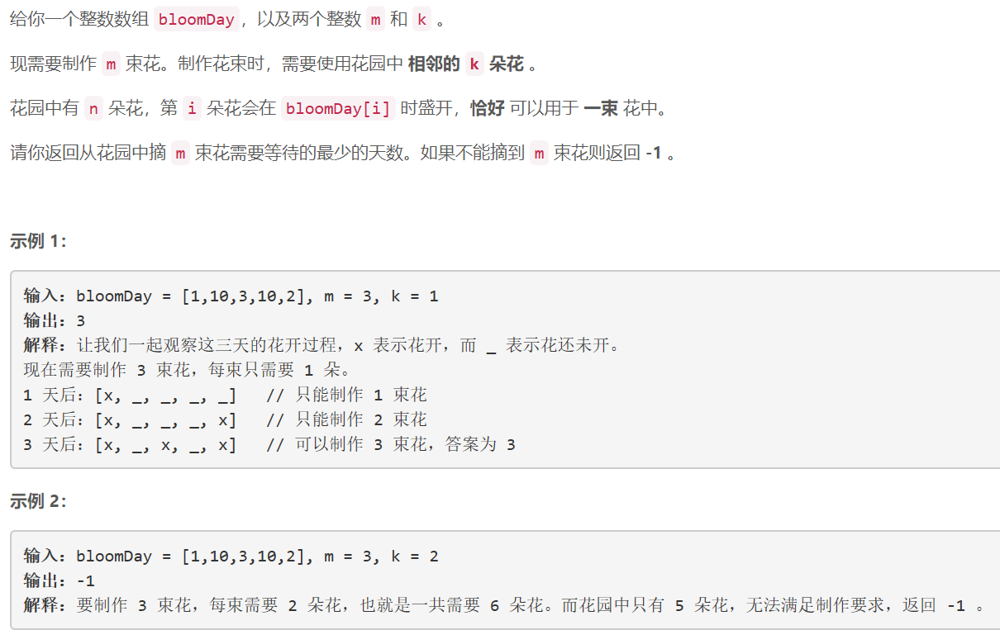

### 1482. 制作 m 束花所需的最少天数

  


## Java solution
```java
class Solution {
    int MAX=(int)(1e9)+5;
    int res=MAX;
    public int minDays(int[] bloomDay, int m, int k) {
        int n=bloomDay.length;
        if(n<(long)m*k) return -1;
        int i,j,l,r,mid,s;
        l=0;
        r=MAX;
        while(l+1<r)
        {
            //l=0 r=1 mid=1如果更新l=mid=1 会导致死循环 所以为l+1<r
            mid=(l+r)>>1;
            for(i=j=s=0;i<n;i++)
            {
                //mid为当前最长等待天数 bloomDay[i]小于最长天数的连续花束数为j  
                if(bloomDay[i]<=mid)++j;
                else 
                {
                    s+=j/k;//j/k为当前能够制作的花束数
                    j=0;
                }
            }
            s+=j/k;
            if(s>=m)r=mid;//当前能够制作的花束数目超过m说明等待天数较高
            else l=mid;
        }
        return r;
    } 

}
```