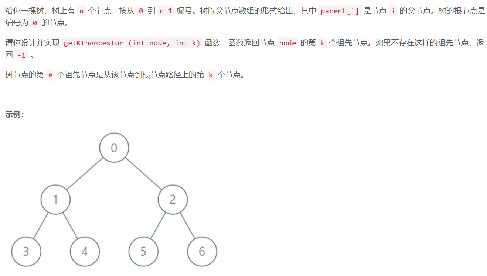
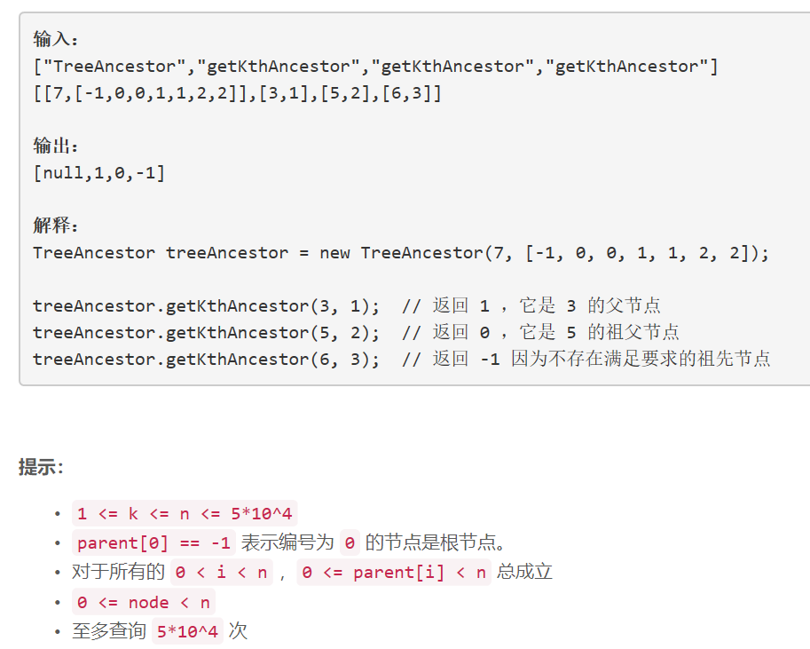

### 1483. 树节点的第 K 个祖先


  

    

## Java solution

```java
class TreeAncestor {
     int[][] dp=new int[50005][16];//dp[node][j] 表示节点node的距离为2^j个父节点
    public TreeAncestor(int n, int[] parent) {
        for(int i=0;i<n;i++)
        {
            dp[i][0]=parent[i];//距离节点i为2^0=1的节点为parent[i]
        }
        for(int j=1;j<16;j++)
        {
            for(int i=0;i<n;i++)
            {
                if(dp[i][j-1]==-1) dp[i][j]=-1;
                else dp[i][j]=dp[dp[i][j-1]][j-1]; //距离节点i为2^j的节点需要先找到2^j-1次的父节点 然后再中安到距离该节点2^j-1次的父节点
            }
        }
    }
    
    public int getKthAncestor(int node, int k) {
        for(int i=15;i>=0;i--)
        {
            if(node!=-1 && k>=1<<i)
            {
                node=dp[node][i];
                k-=1<<i;
            }

        }
        return node;

    }
}

/**
 * Your TreeAncestor object will be instantiated and called as such:
 * TreeAncestor obj = new TreeAncestor(n, parent);
 * int param_1 = obj.getKthAncestor(node,k);
 */
```