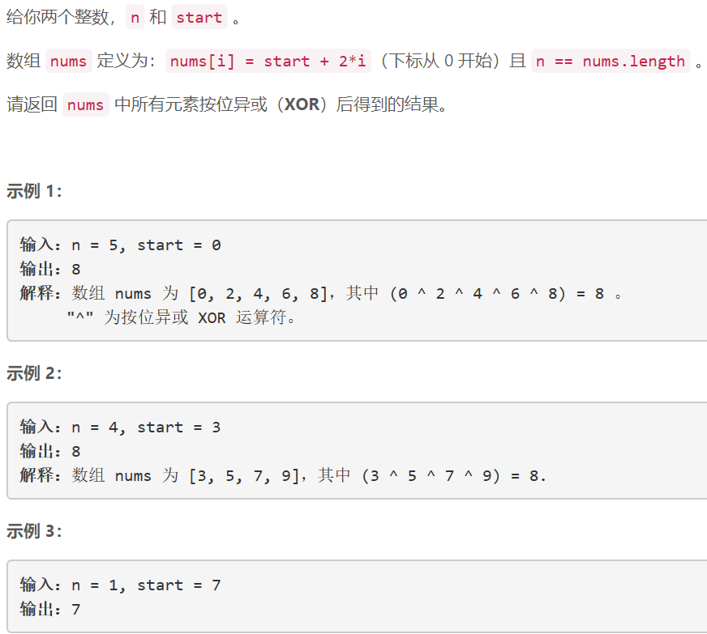
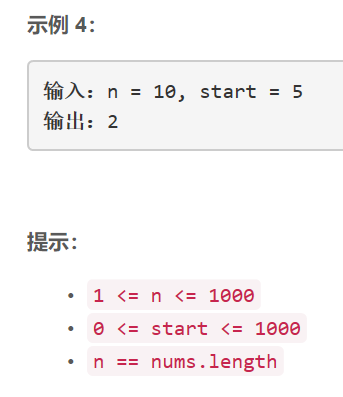

### 5440. 数组异或操作

     



## Java solution

```java
class Solution {
    public int xorOperation(int n, int start) {
        int res=start;
        for(int i=1;i<n;i++)
        {
            int num=start+2*i;
            res^=num;
        }
        return res;
    }
}
```


