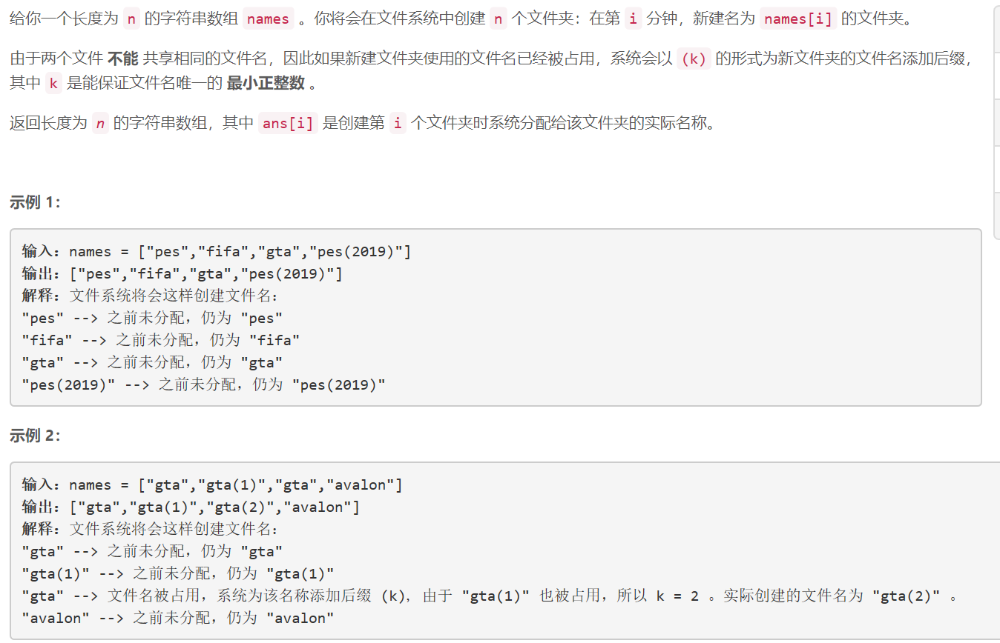

### 5441. 保证文件名唯一


    


## Java solution
```java
class Solution {
    public String[] getFolderNames(String[] names) {
        HashMap<String,Integer> map=new HashMap<>();
        String[] res=new String[names.length];
        for(int i=0;i<names.length;i++)
        {
            String s=names[i];
            int cnt=map.getOrDefault(s,0);
            if(cnt==0)
            {
                res[i]=s;
                map.put(s,cnt+1);
            }
            else
            {
                String cur=s+"("+cnt+")";
                while(map.getOrDefault(cur,0)!=0)
                {
                    cnt++;
                    cur=s+"("+cnt+")";
                }
                res[i]=cur;
                map.put(s,cnt+1);
                map.put(res[i],1);
            }
        }
        return res;
    }
}

```