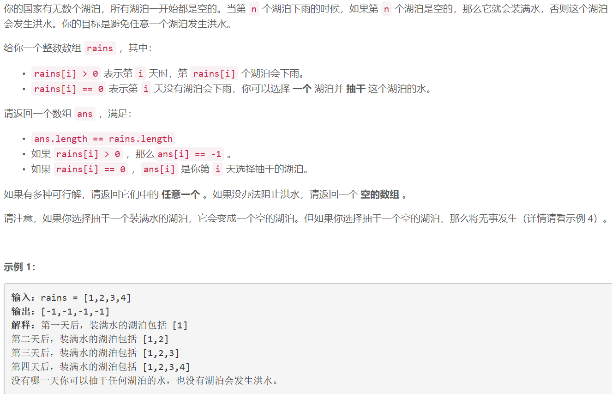
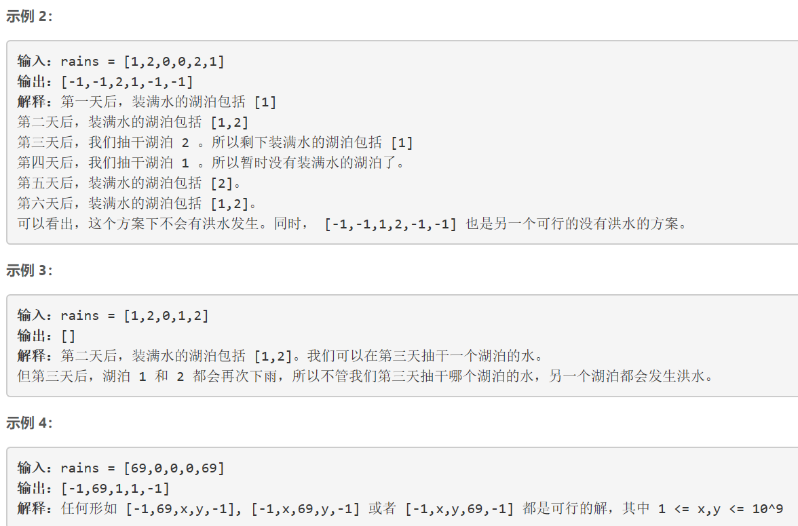
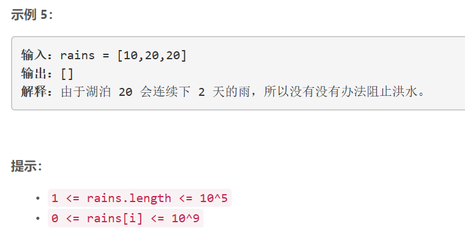

### 5442. 避免洪水泛滥

  






## Java solution
```java
class Solution {
    public int[] avoidFlood(int[] rains) {
       int n=rains.length;
       HashMap<Integer,Integer> map=new HashMap<>(); 
       List<Integer> zero_idx=new LinkedList<>();
       int[] res=new int[n]; 
       for(int i=0;i<n;i++)
       {
           if(rains[i]==0)
           {
               zero_idx.add(i);
           }
           else
           {
               int prev=map.getOrDefault(rains[i],-1);
               if(prev==-1)//如果当前湖泊为空
               {
                   map.put(rains[i],i);
                   res[i]=-1;
               }
               else{//当前湖泊不为空
                   Boolean flag=false;
                   for(Integer idx:zero_idx)
                   {
                       if(idx>prev) //0在当前湖泊之后 可以抽干
                       {
                           res[idx]=rains[i];
                           res[i]=-1;
                           zero_idx.remove(idx);
                           flag=true;
                           map.put(rains[i],i);
                           break;
                       }
                   }
                   if(!flag)return new int[0];
               }
           }
       }
       for(Integer idx:zero_idx) res[idx]=1;
        return res;
    }
    
    
}
```