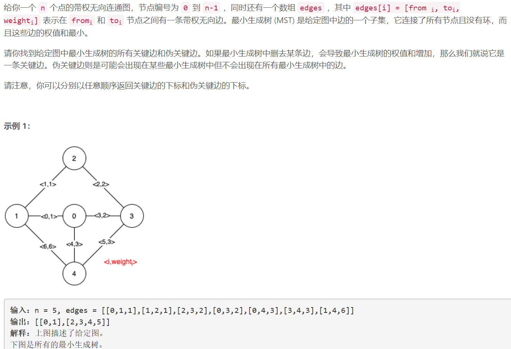
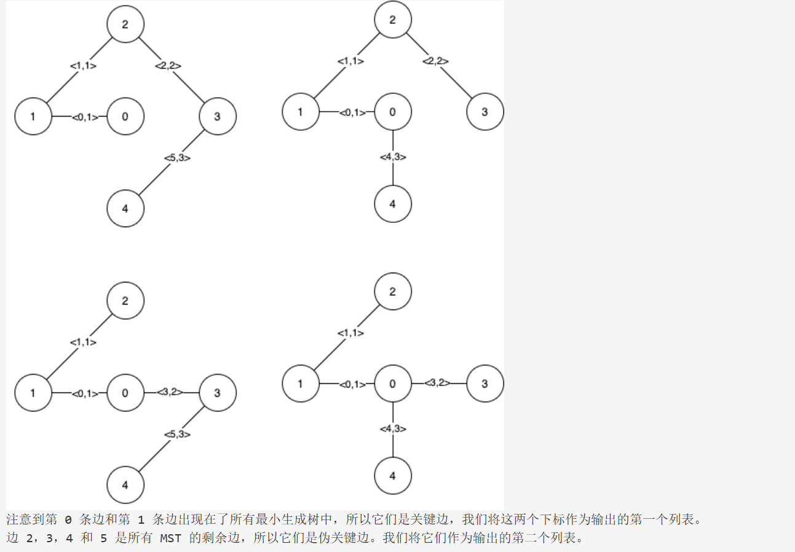
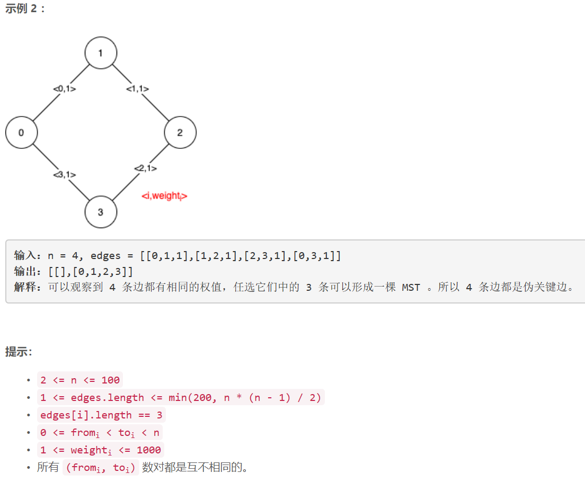

### 5443. 找到最小生成树里的关键边和伪关键边


  

    



[题解]: https://leetcode-cn.com/problems/find-critical-and-pseudo-critical-edges-in-minimum-spanning-tree/solution/shan-chu-bian-yu-jia-ru-bian-zui-xiao-sheng-cheng-/


## Java solution

```java
/*
kruskal 算法

一开始去掉图上的所有边。
按权值从小到大排序边，然后枚举边。
如果发现两个节点不在同一颗树上（用并查集判断），就添加该边。否则跳过该边。
枚举完所有边，最后形成的图就是一棵最小生成树。
*/
class Solution {
    private int[] root=new int[105];
    List<MyEdge> e=new ArrayList<>();
    int nodeNum;
    private int find(int node)//找到node节点的根节点 
    {
        if(root[node]!=node) root[node]=find(root[node]);//根节点是指向它本身的节点
        return root[node]; 
    }

    private int work1(int k) //去掉第k条边 求解得到最小生成树的权重
    {
       for(int i=0;i<nodeNum;i++) root[i]=i;//初始化所有节点的根节点为它自己
       int cost=0,cnt=0;
       for(MyEdge edge:e)
       {
           if(edge.idx==k)continue;
           int root1=find(edge.from),root2=find(edge.to);
           if(root1!=root2) //两个节点的根节点不同说明不再一个集合内
           {
              cost+=edge.weight;
              cnt++;
              if(cnt==nodeNum-1) break;
              root[root1]=root2;//更新根节点           
           }
       }
       if(cnt==nodeNum-1) return cost;//cnt只需要为n-1即可 因为 from和to本身就是相连的
       else return Integer.MAX_VALUE;
    }

    private int work2(int k)//选定第k条边 求解得到最小生成树的权重
    {
       for(int i=0;i<nodeNum;i++) root[i]=i;//初始化所有节点的根节点为它自己
       int cost=0,cnt=0;
       for(MyEdge edge:e)
       {
           if(edge.idx==k)
           {
               root[edge.from]=edge.to;
               cnt++;
               cost+=edge.weight;
               break;
           }
       }
       for(MyEdge edge:e)
       {
           int root1=find(edge.from),root2=find(edge.to);
           if(root1!=root2)
           {
              cost+=edge.weight;
              cnt++;
              if(cnt==nodeNum-1) break;
              root[root1]=root2;//更新根节点           
           }
       }
       if(cnt==nodeNum-1) return cost;//cnt只需要为n-1即可 因为 from和to本身就是相连的
       else return Integer.MAX_VALUE;
    }
    public List<List<Integer>> findCriticalAndPseudoCriticalEdges(int n, int[][] edges) {
        nodeNum=n;
        int m=edges.length;
        for(int i=0;i<m;i++)
        {
            MyEdge edge=new MyEdge(edges[i][0],edges[i][1],edges[i][2],i);
            e.add(edge);
        }        
        Collections.sort(e); //按照权重升序排列
        List<List<Integer>> res=new ArrayList<>();
        for(int i=0;i<2;i++)res.add(new ArrayList<>());
        
        int min_cost=work1(-1);// 求最小生成树的权重和

        for(int i=0;i<m;i++)
        {
            if(work1(i)>min_cost)//判断是否为关键边
            {
              res.get(0).add(i);
            }
            else if(work2(i)==min_cost)//判断是否为伪关键边
            {
              res.get(1).add(i);
            }
        }
        return res;
    }
}

class MyEdge implements Comparable {  
    int from; 
    int to;
    int weight;
    int idx;//当前边的编号  

    public MyEdge(int from,int to,int weight,int idx ) {  
        this.from = from;  
        this.to = to;
        this.weight=weight;
        this.idx=idx;
    }  
    public int compareTo(Object o) { //升序排列
        MyEdge tmp = (MyEdge) o;  
        int result = tmp.weight < weight ? 1 : (tmp.weight==weight ? 0 : -1);  
        return result;  
    }  
}  

```