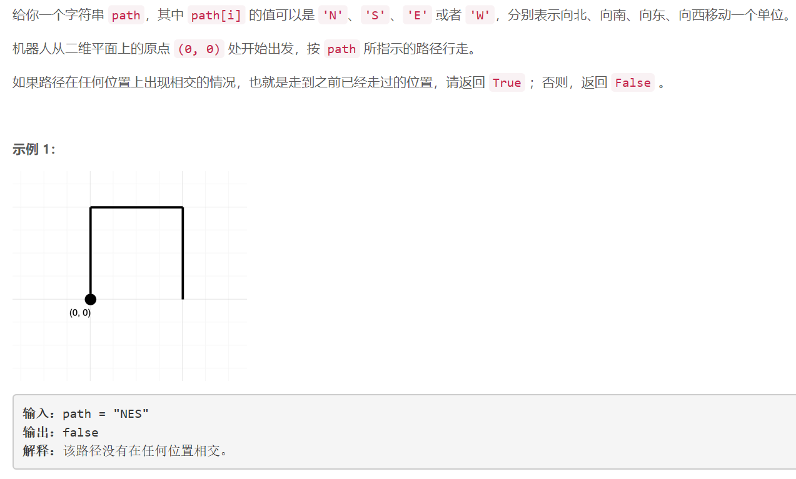
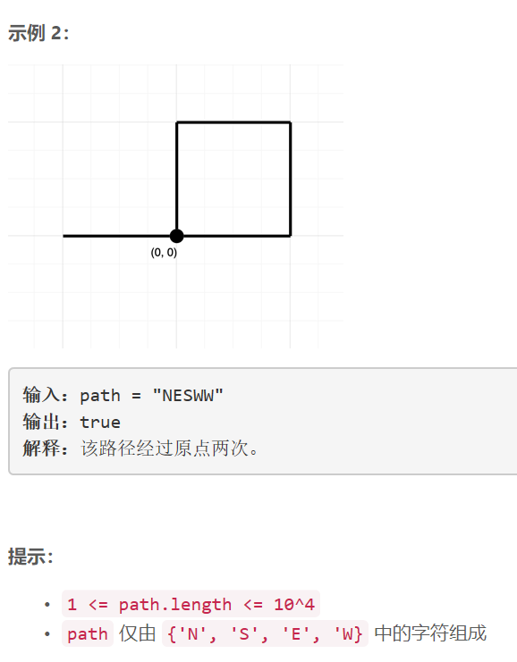

### 5448. 判断路径是否相交

     



## Java solution

```java
class Solution {
    int MAX_LEN=10000;
    public boolean isPathCrossing(String path) {
      Set<Integer> s=new HashSet<>();
      int x=0,y=0;  
      int pos=0;  
      for(char c:path.toCharArray())
      {
          pos=x* MAX_LEN+y;
          if(s.contains(pos)) return true;
          switch(c)
          {
              case 'N': y++;break;
              case 'S': y--;break;
              case 'E': x++;break;
              case 'W': x--;break;
              default:break;
          }
          //pos=x* MAX_LEN+y;
          s.add(pos);  
      }
      if(s.contains(x* MAX_LEN+y)) return true;  
      return false;  
    }
}
```


