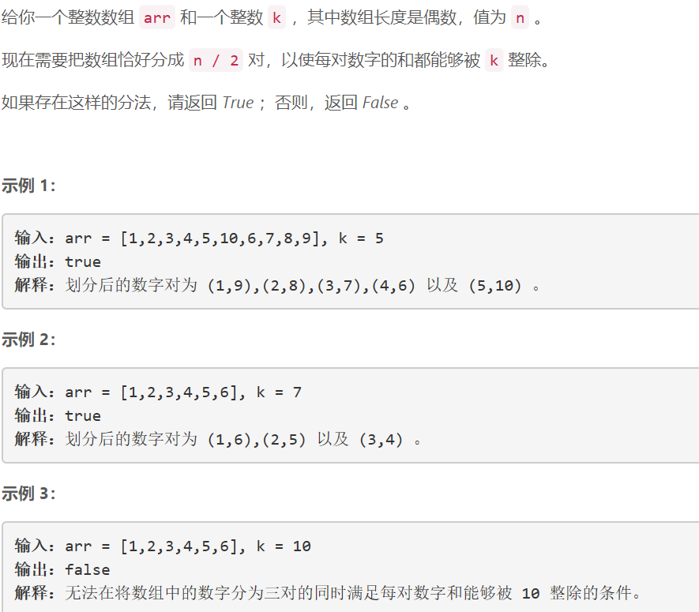
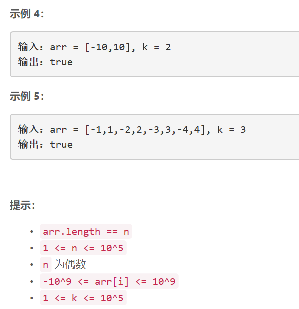

### 5449. 检查数组对是否可以被 k 整除


    




## Java solution
```java
class Solution {
    public boolean canArrange(int[] arr, int k) {  
        int n=arr.length;
        int[] cnt=new int[k];
        for(int i=0;i<n;i++)
        {
            int mod=arr[i]%k;
            int idx=mod<0?mod+k:mod;
            cnt[idx]++;
        }
        for(int i=1;i<k-1;i++)
        {
            if(cnt[i]!=cnt[k-i]) return false;
        }
        if(cnt[0]%2==1) return false;
        return true;
    }
}

```