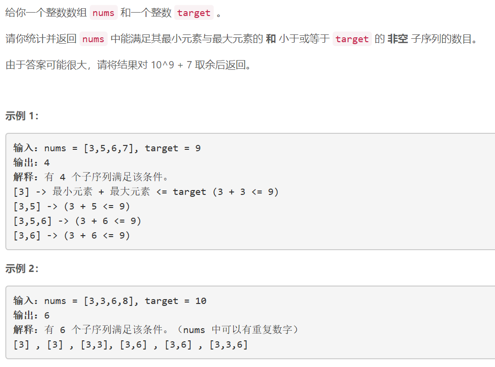
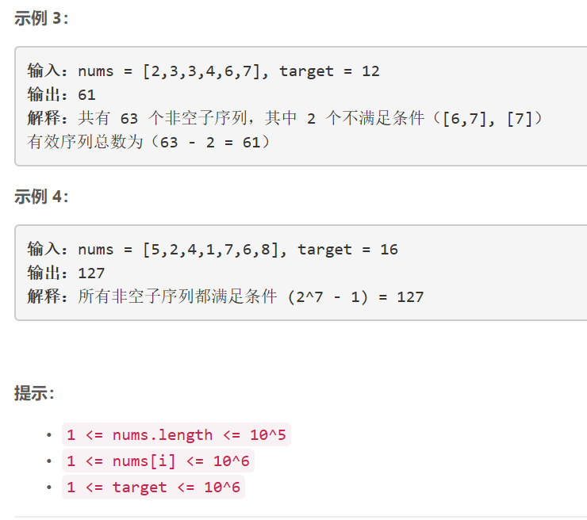

### 5450. 满足条件的子序列数目

  




## Java solution
```java
class Solution {
    int MOD=(int)1e9+7;
    public int numSubseq(int[] nums, int target) {
        Arrays.sort(nums);
        int n=nums.length;
        int[] dp=new int[n];
        for(int i=0;i<n;i++) dp[i]= i==0?1:(dp[i-1]<<1)%MOD;
        int res=0;
        for(int i=0,j=n-1;i<n;i++)
        {
            if(nums[i]*2>target)break;
            while(nums[i]+nums[j]>target)--j;
            res=(res+dp[j-i])%MOD;//包含nums[i]且满足最大值和最小值之和小于target的所有子集数目为dp[j-i] 
        }
        return res;
    }

}
```