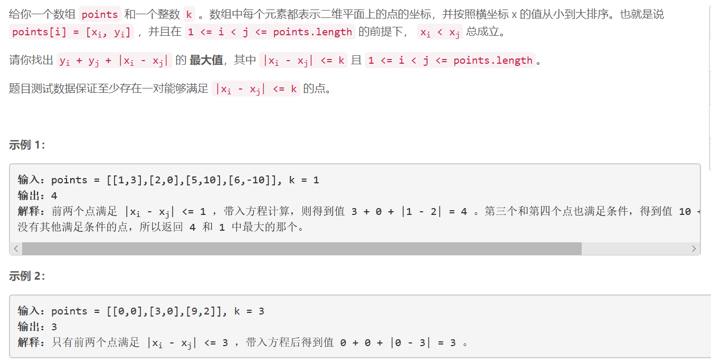
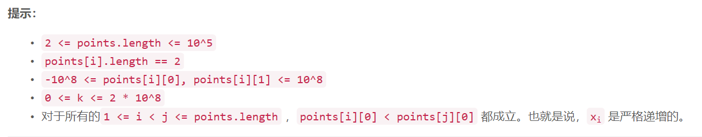

### 5451. 满足不等式的最大值


  

    


## Java solution

```java
class Solution {
    //由于x_i是有序的 因此y_i+y_j+|x_i-x_j| =y_i+x_i + y_j-x_j (i>j)
    //所以给定i只需找到在x_i 距离k范围内的最大y_j-x_j
    //双端队列dq维护和当前x_i距离为k以内的 且小于x_i的point 包括x_j和 y_j-x_j
    public int findMaxValueOfEquation(int[][] points, int k) {
         int res=-(int)1e9;
         Deque<List<Integer>> dq=new LinkedList<>();
         dq.add(Arrays.asList(points[0][0],points[0][1]-points[0][0]));
         int n=points.length;
        
         for(int i=1;i<n;i++)
         {
             while(!dq.isEmpty() && points[i][0]-dq.getFirst().get(0)>k) dq.removeFirst();
             if(!dq.isEmpty()) res=Math.max(res,points[i][0]+points[i][1]+dq.getFirst().get(1));
             while(!dq.isEmpty() &&points[i][1]-points[i][0] >= dq.getLast().get(1)) dq.removeLast();
             //本次循环结束后会加入points[i][1]-points[i][0] 
             //由于x_i比之前加入队列的带你离之后的点更近 因此如果队列后端的点y_j-x_j更小 直接弹出即可
             dq.addLast(Arrays.asList(points[i][0],points[i][1]-points[i][0]));
         }
         return res;          
    }
}
```