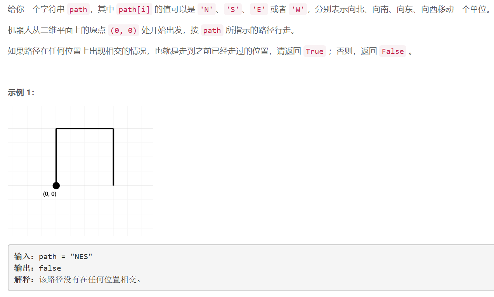

### 5452. 判断能否形成等差数列

     

## Java solution

```java
class Solution {
    public boolean canMakeArithmeticProgression(int[] arr) {
      Arrays.sort(arr);
      int n=arr.length;  
      int diff=arr[0]-arr[1];
      for(int i=1;i<n-1;i++)  if(arr[i]-arr[i+1]!=diff) return false;
      return true;  
    }
}
```


