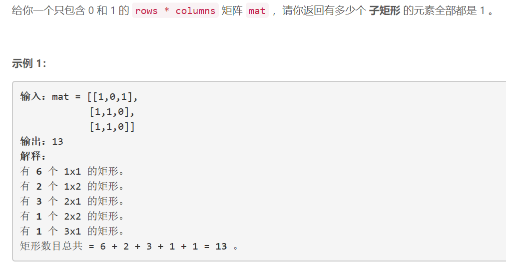
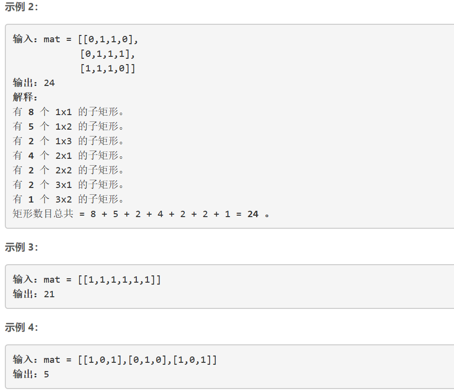
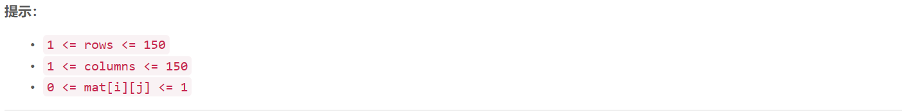

### 5454. 统计全 1 子矩形

  






## Java solution
```java
class Solution {
    int[] sum=new int[155];
    public int numSubmat(int[][] mat) {
        int m=mat.length,n=mat[0].length;
        for(int i=0;i<n;i++) sum[i]=0;
        int res=0;
        for(int i=0;i<m;i++)
        {
            for(int j=0;j<n;j++)  //sum[j] 表示当前行中 每个元素和其上方的连续的1构成列的长度
            {
                if(mat[i][j]==1)sum[j]++;
                else sum[j]=0;
            }
            //以当前行第k个元素为矩形左边界 当前行第j个元素为矩形右边界引入的矩形数 为二者之间最小高度值h_min 
            //二者能构成的矩形种类有高度为1，高度为2,...高度为h_min 
            for(int k=0;k<n;k++)for(int j=k,h_min =1<<30;j<n;j++)
            {
                h_min=Math.min(h_min,sum[j]);
                res+=h_min ;
            }
        }
        return res;
    }
}
```