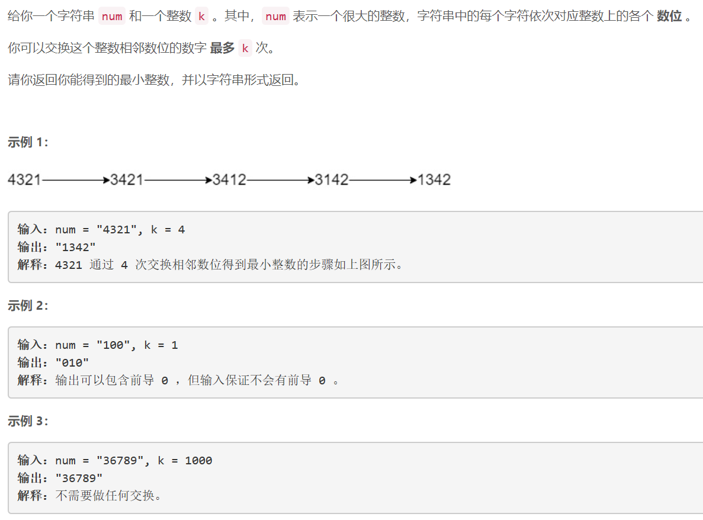
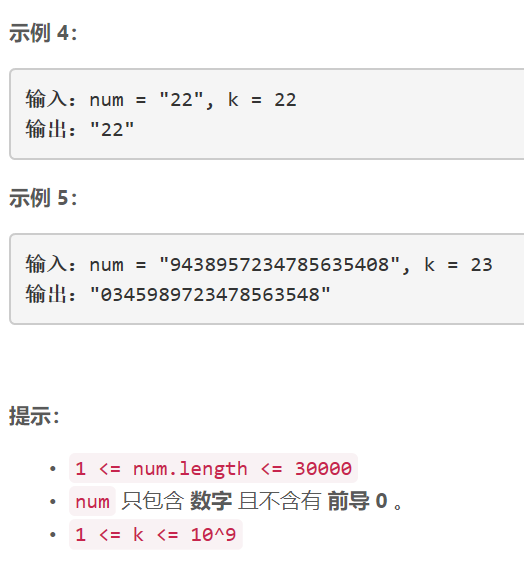

### 5455. 最多 K 次交换相邻数位后得到的最小整数


  

    


## Java solution

```java
//树状数组 https://www.cnblogs.com/xenny/p/9739600.html

class Solution {
    int[] sum=new int[(int)3e4+1];
    int n;
    
    int lowbit(int x) 
    {  //-x是对x取反加一 因此此操作可以获得x的最低位1  比如x==100100b return 100b
       return x&-x;
    }
    //总体思想是一个元素被换到前面 那么它前面的元素要集体向后移一位
    //这里选择该元素后面的元素-1 而不是前面的元素+1 二者是等价的
    void add(int x,int v)  //更新与x相关的数组元素
    {
         for(int i=x;i<=n;i+=lowbit(i))
         {
             sum[i]+=v;
         }
    }
    int get(int x) //logN复杂度  返回从1--x的数组元素和 
    {
        int res=0;
        for(int i=x;i>0;i-=lowbit(i))
        {
            res+=sum[i];
        }
        return res;
    }
    public String minInteger(String num, int k) {
        char[] c=num.toCharArray();
        List<List<Integer>> pos=new ArrayList<>();// pos[i] 表示数字i在num中出现的索引 cur[i]表示数字i在pos[i]中使用到那一位了
        int[] cur=new int[10];
        n=num.length();
        for(int i=0;i<=n;i++) sum[i]=0;
        for(int i=0;i<10;i++) pos.add(new ArrayList<>());
        for(int i=0;i<n;i++) pos.get((int)(c[i]-'0')).add(i+1);
        String s="";
        for(int i=1;i<=n;i++)
        {
            //贪心的思想 对num从高位到低位遍历 尝试改变每一位为低位中最小的数
            for(int j=0;j<10;j++)
            {
                if(cur[j]>=pos.get(j).size()) continue;//数字k在已经全部被置换到了高位 低位中没有可用的k了
                int op=pos.get(j).get(cur[j]);//数字k未交换之前的位置
                int p=op+get(op)-1;//数字k的真实位置 get(op)是数字k在树状数组中的位置
                if(p<=k)
                {
                    k-=p;
                    cur[j]++;
                    s+=(char)('0'+j);
                    add(op,-1);
                    break;
                }
            }
        }
        return s;
    }
}

```