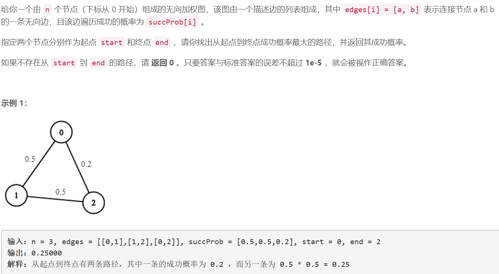
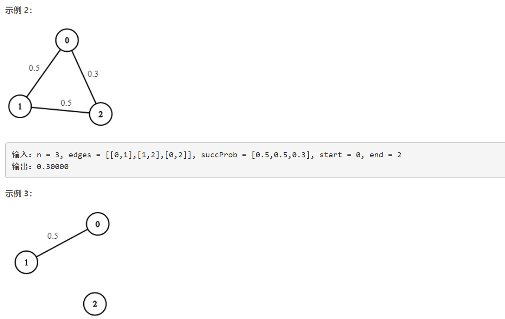
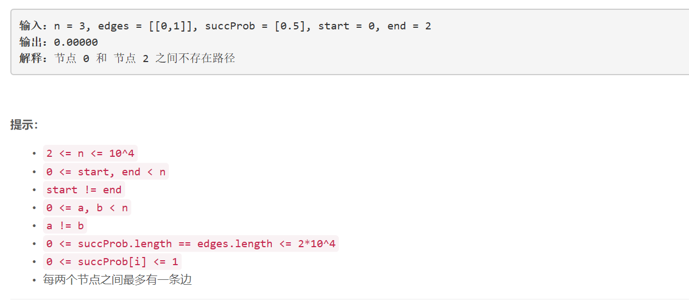

### 5211. 概率最大的路径

  






## Java solution
```java
class Solution {
    //bfs + 优先级队列
    public double maxProbability(int n, int[][] edges, double[] succProb, int start, int end) {
       List<double[]>[] graph=new ArrayList[n];
       boolean[] visited=new boolean[n];
       for(int i=0;i<n;i++) graph[i]=new ArrayList<>();
       for(int i=0;i<edges.length;i++)
       {
           graph[edges[i][0]].add(new double[]{edges[i][1],succProb[i]});
           graph[edges[i][1]].add(new double[]{edges[i][0],succProb[i]});
       }
       PriorityQueue<double[]> q=new PriorityQueue<>((a,b)->Double.compare(b[1],a[1]));
       q.add(new double[]{start,1.0});//edge:{当前节点i,start到i的概率}}
       while(!q.isEmpty())
       {
           double[] cur=q.remove();//弹出概率最大的节点
           if(visited[(int)cur[0]])continue;//如果路径中有环 一定不是最大概率(因为概率<1)
           if(cur[0]==end) return cur[1];//弹出前一个Level能到达end的概率中最大的那个
           //不存在比这个概率更大的路径 因为level数目越多概率越小 level是单增的
           visited[(int)cur[0]]=true;
           for(double[] edge:graph[(int)cur[0]])
           {
               q.add(new double[]{edge[0],edge[1]*cur[1]});
           }
       }   
       return 0.0;   
    }
}
```