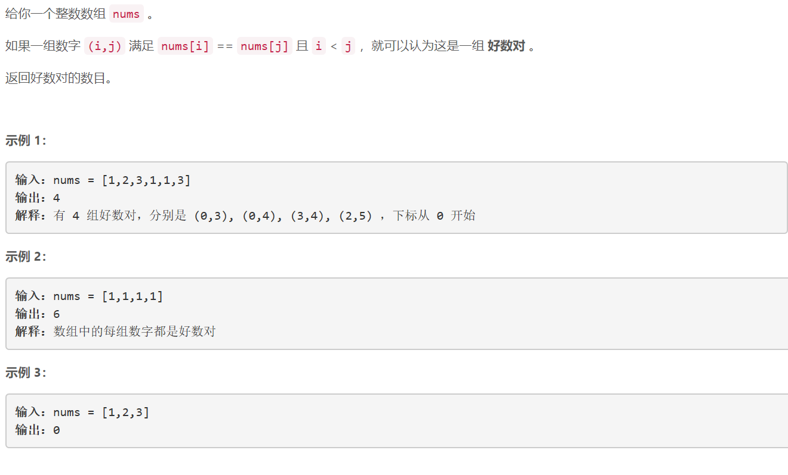
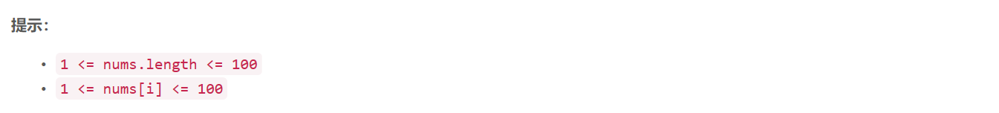

### 5460. 好数对的数目

     



## Java solution

```java
class Solution {
    public int numIdenticalPairs(int[] nums) {
        int n=nums.length;
        int res=0;
        for(int i=0;i<n;i++)for(int j=i+1;j<n;j++)
            if(nums[i]==nums[j])++res;
        return res;
    }
}
```


