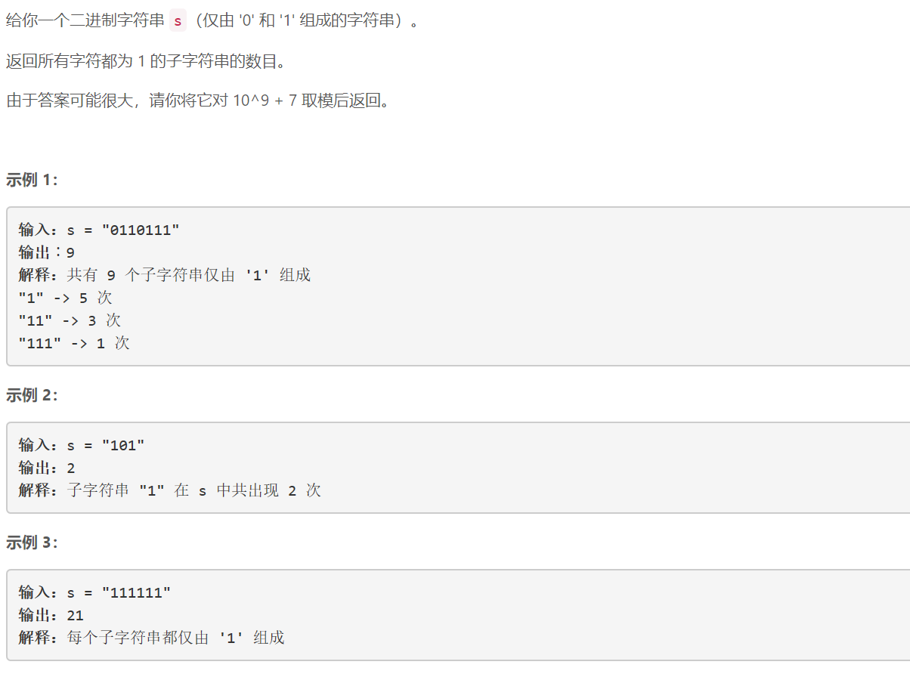
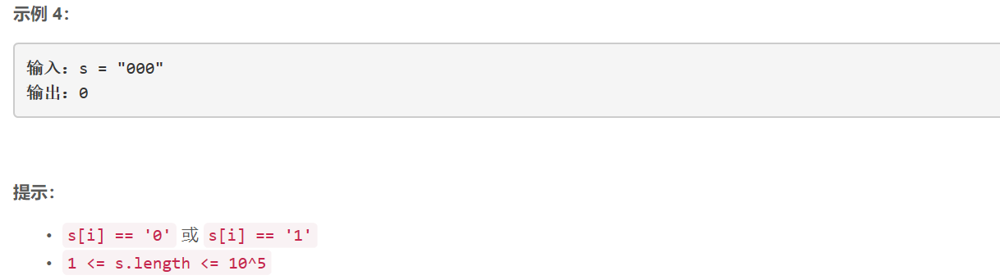

### 5461. 仅含 1 的子串数


    




## Java solution
```java
class Solution {
    int mod=(int)1e9+7;
    public int numSub(String s) {
       int i,cnt,res=0,n=s.length();
       int[] dp=new int[n+1];
       for(i=1;i<=n;i++)
       {
           dp[i]=(dp[i-1]+i)%mod;
       }
       i=0; 
       while(i<n)
       {
           cnt=0;
           while(i<n && s.charAt(i)=='0')++i;
           while(i<n && s.charAt(i)=='1'){++i;++cnt;}
           res=(res+dp[cnt])%mod;
       }
       return res; 
    }
}

```