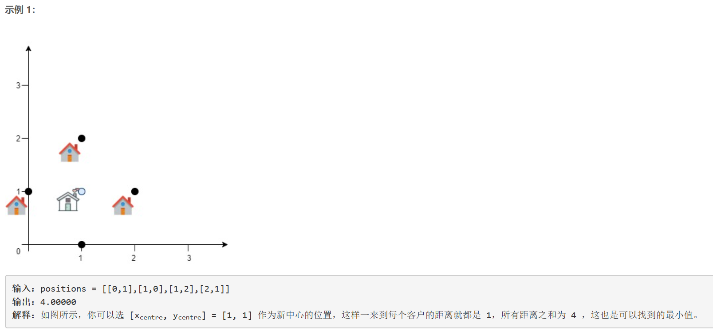
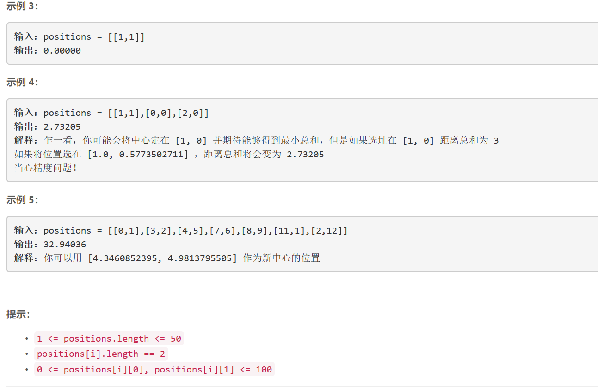

### 5463. 服务中心的最佳位置


  

    




## Java solution

```java
class Solution {
    //梯度法
    public double getMinDistSum(int[][] positions) {
         int n=positions.length;
         double center_x=0.0,center_y=0.0;
         for(int[] p:positions)
         {
             center_x+=p[0];
             center_y+=p[1];
         }
        center_x/=n;
        center_y/=n;
        double step_size=1000;//当迭代步长
        double[][] direction={{-1.0,0.0},{1.0,0.0},{0.0,-1.0},{0.0,1.0}};//四个搜索方向
        double min_distance=sumDistance(center_x,center_y,positions);
        while(step_size>1e-7)//直到迭代步长收敛
        {
            boolean flag=false;
            for(double[] d:direction)//搜索下降方向
            {
                double new_center_x=center_x+d[0]*step_size;
                double new_center_y=center_y+d[1]*step_size;
                double new_distance=sumDistance(new_center_x,new_center_y,positions);
                if(new_distance<min_distance)
                {
                    flag=true;
                    min_distance=new_distance;
                    center_x=new_center_x;
                    center_y=new_center_y;
                    break;//找到下降方向 跳出循环
                }
            }
            if(!flag)step_size/=2;//如果没有找到一个下降方向则说明需要将步长减小
        }
        return min_distance;
    }
    private double sumDistance(double x,double y,int[][] positions)
    {
        double sum=0.0;
         for(int[] p:positions)
         {
             double pow_x=Math.pow(x-p[0],2);
             double pow_y=Math.pow(y-p[1],2);
             sum+=Math.sqrt(pow_x+pow_y);
         }
         return sum;
    }
}

```