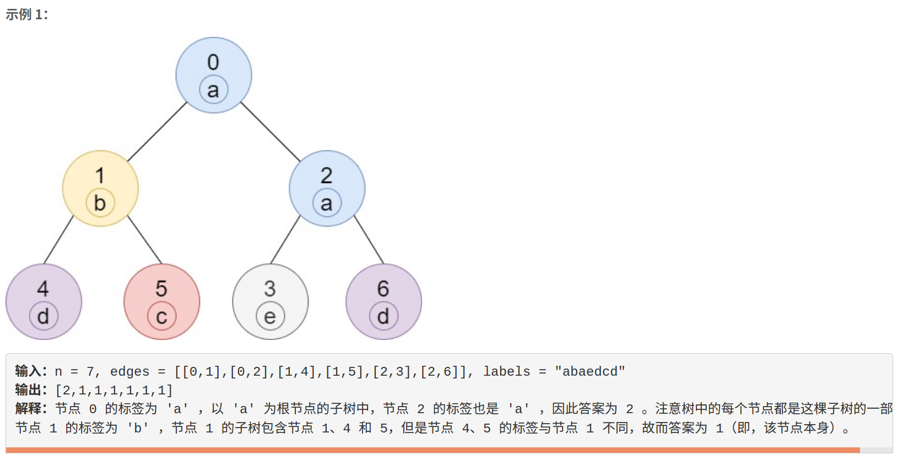

### 5465. 子树中标签相同的节点数

     



     


     


## Java solution

```java
class Solution {
    List<Integer>[] nodes;
    boolean[] visited;
    int[] res;
    int[][] cnt;
    public int[] countSubTrees(int n, int[][] edges, String labels) {
         nodes=new ArrayList[n];
         for(int i=0;i<n;i++)nodes[i]=new ArrayList<>();
         visited=new boolean[n];
         res=new int[n];
         cnt=new int[n][26];
         for(int[] e:edges)
         {
             nodes[e[0]].add(e[1]);
             nodes[e[1]].add(e[0]);
         }
         dfs(0,labels.toCharArray());
         return res;
    }
    
    private void dfs(int n,char[] labels)
    {
        cnt[n][labels[n]-'a']++;
        visited[n]=true;
        for(Integer node:nodes[n])
        {
            if(visited[node])continue;
            dfs(node,labels);
            for(int i=0;i<26;i++)cnt[n][i]+=cnt[node][i];
        }
        res[n]=cnt[n][labels[n]-'a']; 
    }
}
```


