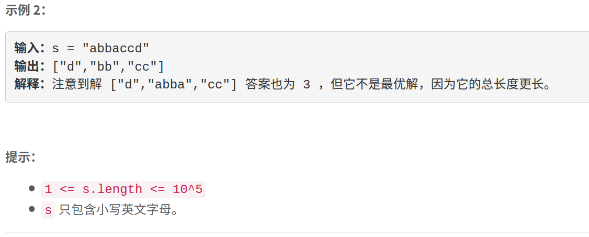

### 5466. 最多的不重叠子字符串


    




## Java solution
```java
class Solution {
    /*
    首先要读明白一句话：如果一个子字符串包含字符 c ，那么 s 中所有 c 字符都应该在这个子字符串中。
这句话里包含了一个递归的潜规则——如果一个子串包含 c，那么该子串必须包含所有的 c，又因为这些 c 中间可能插入了其他的字符 h，所以该子串也应该包含所有的 h，进而 h 中间还可能插入了 a，所以该子串中也应该包含所有的 a，依次类推，直到不会引入新的字符类别！
想明白了这个潜规则就能得出子串个数不会超过26的结论。26字母有序排列，不互相掺杂，这个时候可以划分出26个子串。只要字符互相掺杂，就必然会使子串数量减少。比如，aabbcc 最多可以划分出三个子串(aa,bb,cc)，abbacc 最多只能划分出两个(abba,cc 或者 bb,cc)。
    */
    public List<String> maxNumOfSubstrings(String s) {
         int n=s.length();
         int[] left=new int[26];//left[i]表示s中字符char(i+'a')满足规则2的最左侧索引
         int[] right=new int[26];
         Node[] dp=new Node[n+1];
         for(int i=0;i<=n;i++) dp[i]=new Node(0,0,-1);
         for(int i=0;i<26;i++)
         {
             char c=(char)(i+'a');
             left[i]=s.indexOf(c);
             right[i]=s.lastIndexOf(c);
         }
         //若left[i]和right[i]之间包括其它字符 需要将区间扩展  保证区间互不重叠
         for(int i=0;i<26;i++)
         {
             if(left[i]!=-1)
             {
                 int rightMost=right[i];
                 for(int j=left[i]+1;j<rightMost;j++)
                 {
                     int idx=s.charAt(j)-'a';
                     if(left[i]<=left[idx]&& right[i]>=right[idx])continue;
                     left[i]=Math.min(left[idx],left[i]);
                     right[i]=Math.max(right[idx],right[i]);
                     j=left[i];
                     rightMost=right[i];
                 }
             }
         }
         //动态规划 dp[n] 表示字符串s(0,n]区间内最符合要求的(数目最多或者数目相同 长度最短)
         for(int i=1;i<=n;i++)
         {
            int idx=s.charAt(i-1)-'a';
            if(right[idx]==i-1)
            {
               Node cur=new Node(0,0,-1);
               cur.cnt=dp[left[idx]].cnt+1;
               cur.len=dp[left[idx]].len+right[idx]-left[idx]+1;
               cur.pre=left[idx];
               if(cur.cnt>dp[i-1].cnt||(cur.cnt==dp[i-1].cnt&&cur.len<dp[i-1].len))
               {
                   dp[i]=cur;
               } 
               else dp[i]=dp[i-1];
            }
            else dp[i]=dp[i-1];
         }
         List<String> res=new ArrayList<>();
         int idx=n,sum=dp[n].len;
         while(sum>0)
         {
            int start=dp[idx].pre;
            int end=right[(int)(s.charAt(start)-'a')]+1;
            String str=s.substring(start,end);
            sum-=str.length();
            res.add(str);
            idx=start;
         }
         return res;
    }

   
}

class Node
{
    int cnt; // 子串个数
    int len; // 子串总长度
    int pre; // 当前状态中最后一个子串的其实位置
    Node(int cnt,int len,int pre)
    {
       this.cnt=cnt;
       this.len=len;
       this.pre=pre;
    }
}

```
