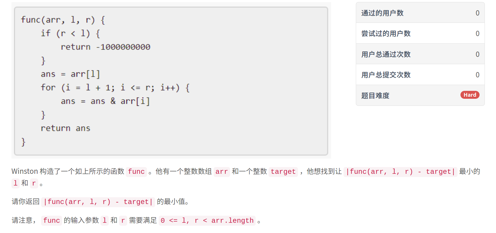

### 5467. 找到最接近目标值的函数值


  

  

  

    

## Java solution

```java
class Solution {
    //这里的关键是维护一个最多只有24个元素的集合 集合不能有重复--因为arr[r]固定求按位与之和 最多有arr[r]最大值的二进制数位数个 因为与操作只能1->0 不能0->1
    public int closestToTarget(int[] arr, int target) {
        Set<Integer> valid=new HashSet<>();
        valid.add(arr[0]);
        int res=Math.abs(target-arr[0]);
        for(Integer num:arr)
        {
            Set<Integer> newValid=new HashSet<>();//固定arr[r] 求左边的按位与之和 最多有24种可能 max=10^6=2^20
            res=Math.min(res,Math.abs(target-num));
            for(Integer prev:valid)
            {
                int cur=prev&num;
                if(!newValid.contains(prev))
                {
                    newValid.add(cur);
                    res=Math.min(res,Math.abs(target-cur));
                }
            }
        }
        return res;
    }
}
```
