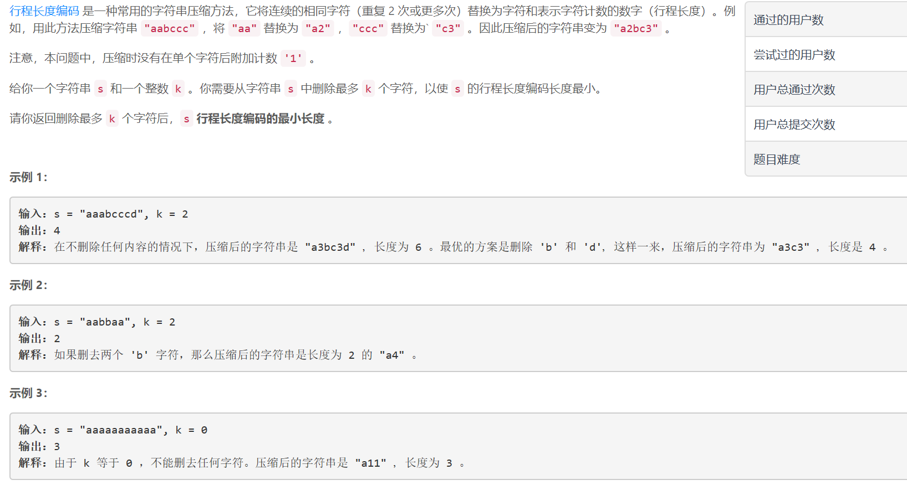
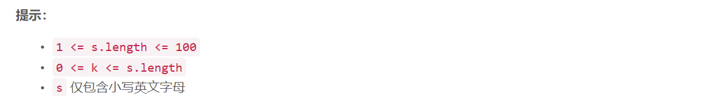

### 5462. 压缩字符串 II


  

    

## Java solution

```java
class Solution {
    int[][] dp=new int[105][105];//dp[i][j] 表示s(0,i]区间去掉j个元素的最短编码长度
    public int getLengthOfOptimalCompression(String s, int k) {
        char[] str=s.toCharArray();
        int n=str.length;
        for(int i=0;i<=n;i++)for(int j=0;j<=n;j++)dp[i][j]=300;
        dp[0][0]=0;
        for(int i=1;i<=n;i++)
        {
            for(int j=0;j<=k;j++)
            {
                //这里考虑到了"aaaaaa" k=2 这种情况--也就是删掉str[i-1]
                dp[i][j+1]=Math.min(dp[i][j+1],dp[i-1][j]);//在str[i]位置删j+1个元素的所有可行方案中 包括str[i-1]位置处删j个元素 之后再删掉str[i]
                int cnt=0;
                int del=0;
                //这里只考虑保留和str[i-1]相同的元素 删掉与之不同的元素
                for(int l=i;l<=n;l++)//当前区间从str[i-1]开始 删除del个元素 保留和str[i-1]相同的连续的cnt个元素
                {
                    cnt+=str[l-1]==str[i-1]?1:0;
                    del+=str[l-1]==str[i-1]?0:1;//
                    if(j+del<=k)
                    {
                        
                        int len=(cnt>1?Integer.toString(cnt).length():0)+1;//计算增加的编码长度--cnt=1则忽略个数
                        dp[l][j+del]=Math.min(dp[l][j+del],dp[i-1][j]+len);
                    }
                }
            }
        }
        return dp[n][k];
         
    }

}


```