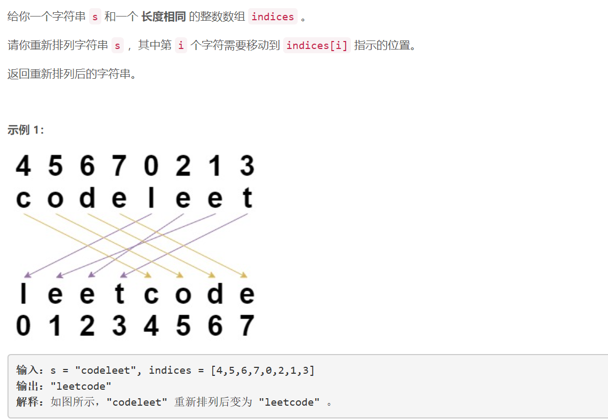
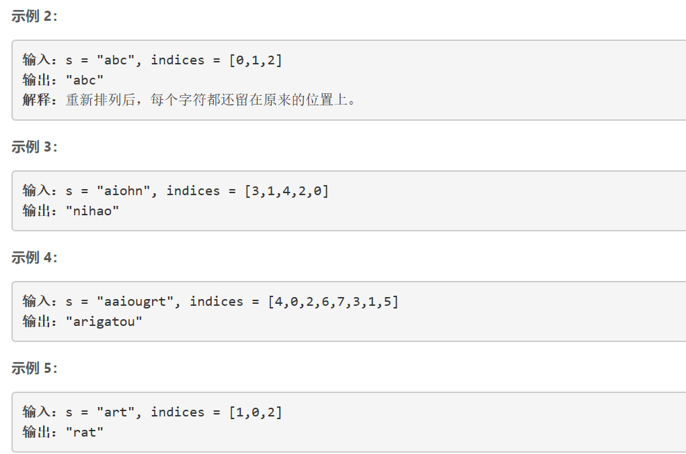
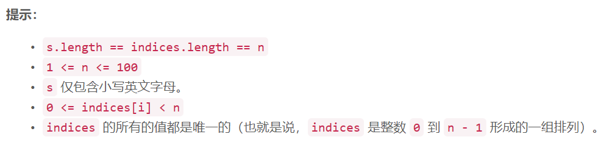

### 5472. 重新排列字符串

  






## Java solution
```java
class Solution {
    public String restoreString(String s, int[] indices) {
       char[] c=s.toCharArray();
       char[] res=new char[c.length];
       for(int i=0;i<c.length;i++)
       {
           res[indices[i]]=c[i];
       }
       
       return String.valueOf(res); 
    }
}
```