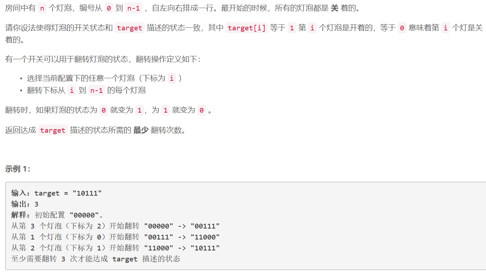
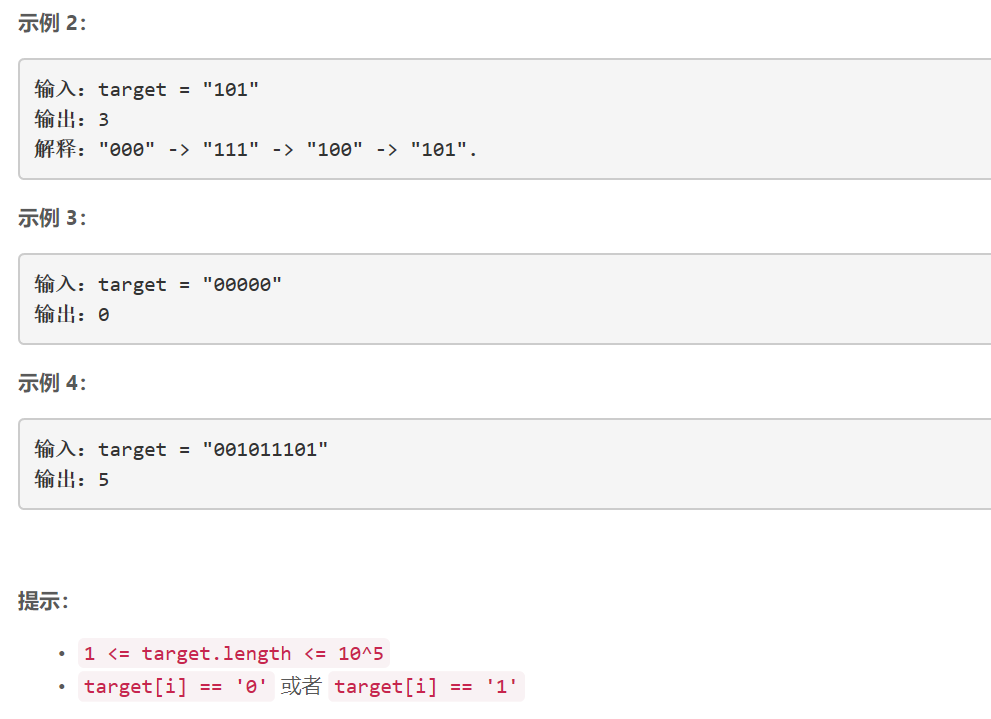

### 5473. 灯泡开关 IV

     



## Java solution

```java
class Solution {
    public int minFlips(String target) {
      char[] t=target.toCharArray();
      int cnt=0,n=t.length;
      for(int i=0;i<n;)
      {
          int zero_cnt=0;
          while(i<n&&t[i]=='0')
          {
              ++i;
              ++zero_cnt;
          }
          int one_cnt=0;
          while(i<n&&t[i]=='1')
          {
              ++i;
              ++one_cnt;
          }
          cnt+=one_cnt==0?0:1;
      }
      if(cnt==0) return 0;  
       return t[n-1]=='0'?cnt*2:cnt*2-1; 
    }
}
```


