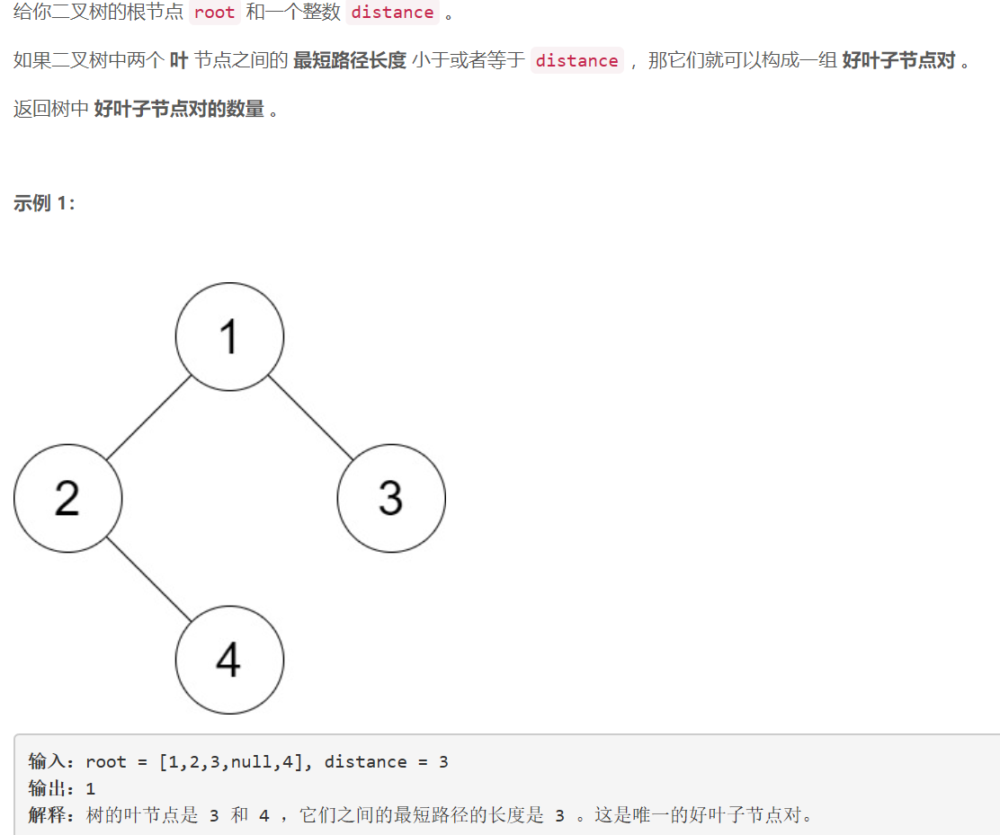
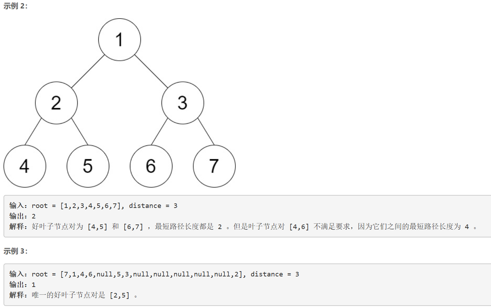
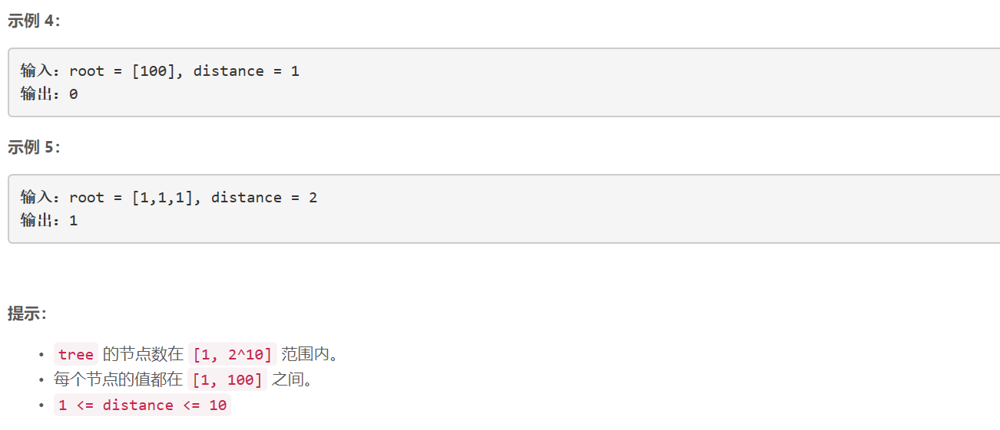

### 5461. 仅含 1 的子串数


    






## Java solution
```java
/**
 * Definition for a binary tree node.
 * public class TreeNode {
 *     int val;
 *     TreeNode left;
 *     TreeNode right;
 *     TreeNode() {}
 *     TreeNode(int val) { this.val = val; }
 *     TreeNode(int val, TreeNode left, TreeNode right) {
 *         this.val = val;
 *         this.left = left;
 *         this.right = right;
 *     }
 * }
 */
class Solution {
    int res=0;
    public int countPairs(TreeNode root, int distance) {
        dfs(root,distance);
        return res;
    }
    private List<Integer> dfs(TreeNode root,int d)
    {
        if(root==null) return null;
        List<Integer> l=dfs(root.left,d);//左侧叶节点到当前节点的距离集合
        List<Integer> r=dfs(root.right,d);//右侧叶节点到当前节点的距离集合
        List<Integer> cur=new ArrayList<>();
        if(l==null && r==null)//当前节点为根节点
        {
            cur.add(0);
            return cur;
        }
        if(l==null)//左侧节点为空
        {
            for(Integer n:r) cur.add(n+1);
            return cur;
        }
        if(r==null)//右侧节点为空
        {
            for(Integer n:l) cur.add(n+1);
            return cur;
        }
        for(Integer n1:l)//当前节点为左右根节点的最小公共祖先 遍历左右根节点
        {
            for(Integer n2:r)
            {
                if(n1+n2+2<=d)res++;//如果满足路径和小于d 则说明该路径满足要求
            }
        }
        for(Integer n:l) cur.add(n+1);
        for(Integer n:r) cur.add(n+1);
        return cur;
           
    }
}

```