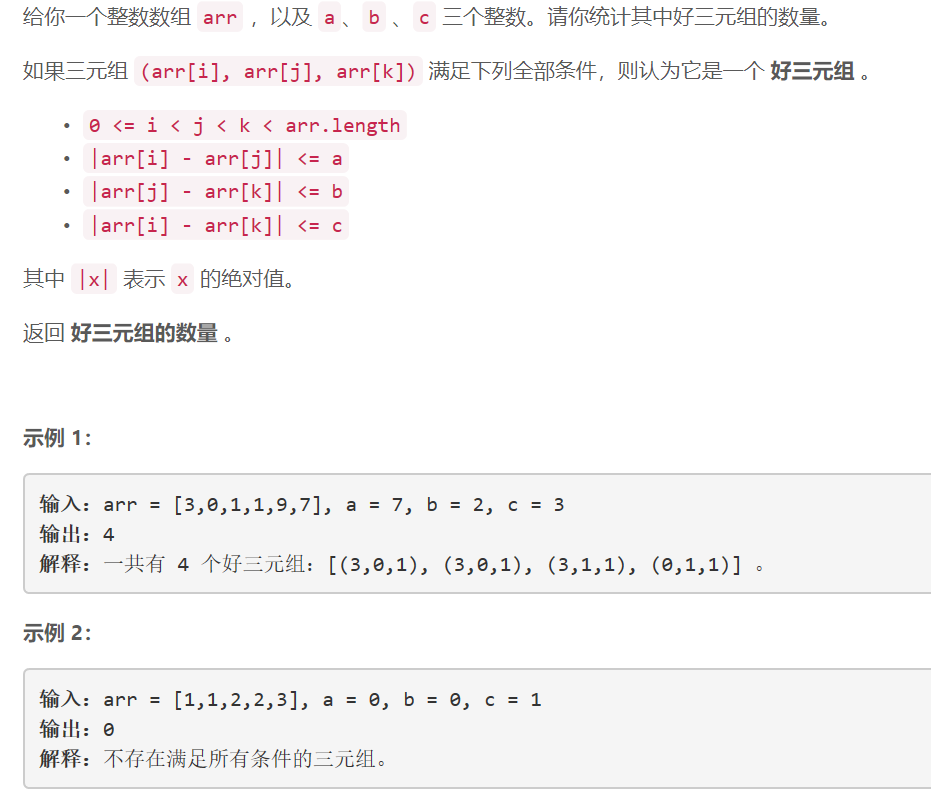
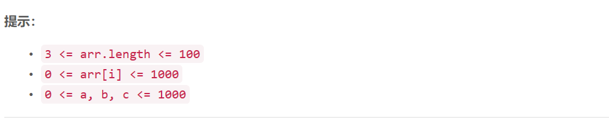

### 5475. 统计好三元组

###   

    

## Java solution

```java
class Solution {
    public int countGoodTriplets(int[] arr, int a, int b, int c) {
       int i,j,k;
       int n=arr.length,cnt=0;
       for(i=0;i<n;i++) for(j=i+1;j<n;j++)
       {
           if(Math.abs(arr[i]-arr[j])<=a)
           {
               for(k=j+1;k<n;k++)
               {
                   if(Math.abs(arr[k]-arr[j])<=b && Math.abs(arr[i]-arr[k])<=c)cnt++;
               }
           }
       }
       return cnt; 
    }

}

```