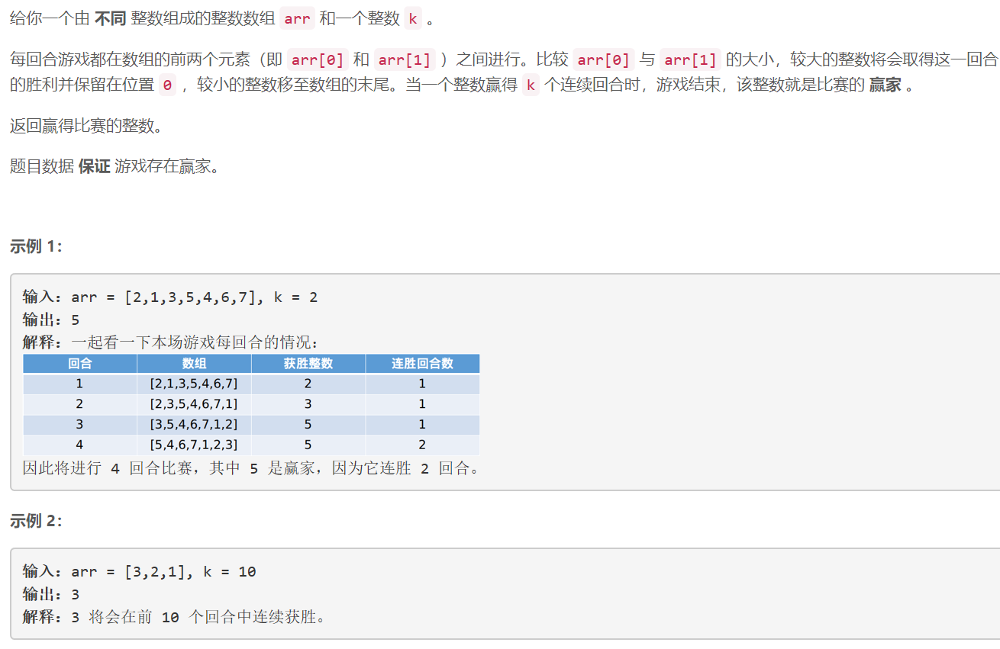
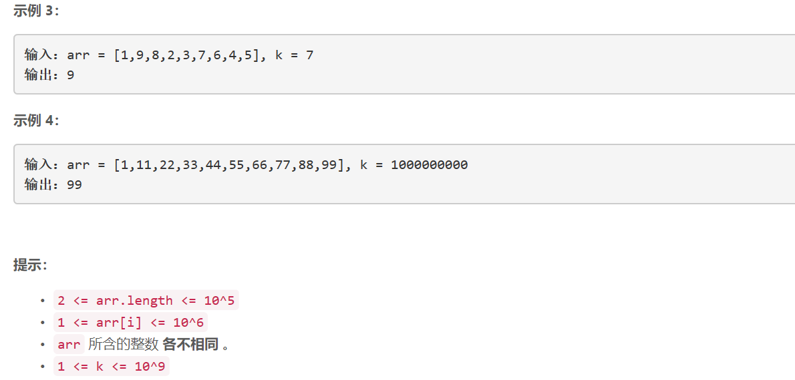

### 5476. 找出数组游戏的赢家

  




## Java solution
```java
class Solution {
    public int getWinner(int[] arr, int k) {
        int cnt=0;
        int n=arr.length,winNum=arr[0];
        for(int i=1;i<n;i++)
        {
            if(arr[i]>winNum)
            {
                winNum=arr[i];
                cnt=1;
            }
            else
            {
                cnt++;
            }
            if(cnt==k) return winNum;
        }
        return winNum;
    }
}
```