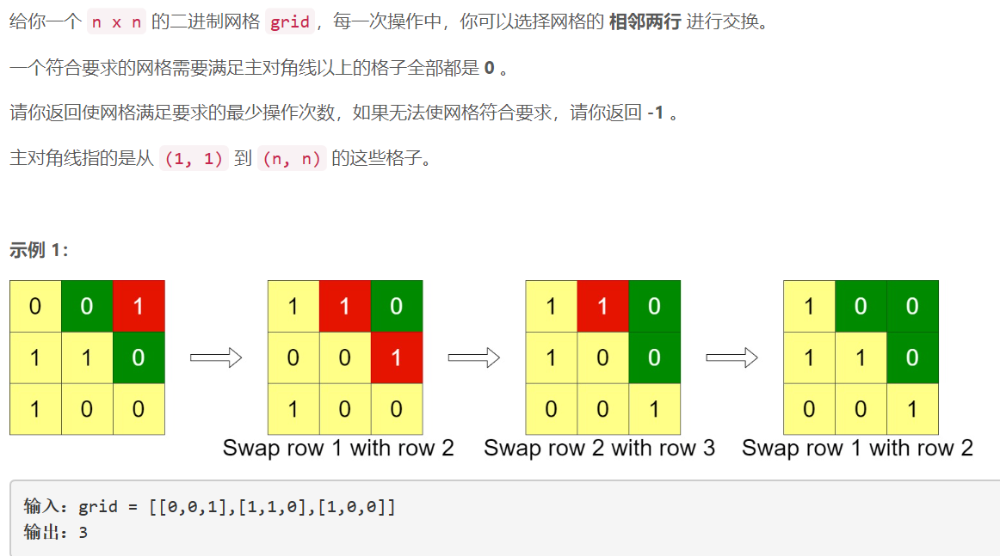
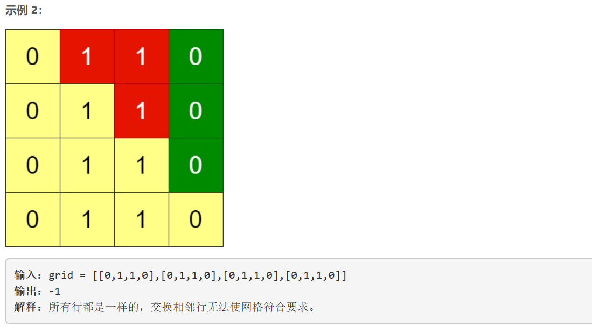
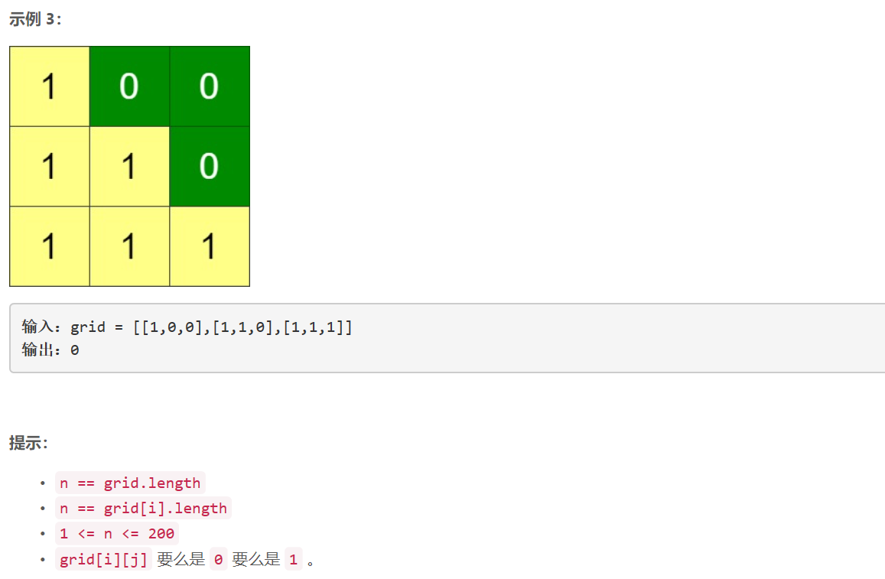

### 5477. 排布二进制网格的最少交换次数

###      





## Java solution

```java
class Solution {
    public int minSwaps(int[][] grid) {
       int n=grid.length,m=grid[0].length;
       List<Integer> cnt=new ArrayList<>(); 
       int res=0; 
       for(int i=0;i<n;i++)cnt.add(countZeros(grid[i]));
       for(int i=0;i<n;i++)
       {
           int need=n-i-1;
           if(cnt.get(i)<need)
           {
               boolean flag=false;
               for(int j=i+1;j<n;j++) if(cnt.get(j)>=need)
               {
                   flag=true;
                   int temp=cnt.get(j);
                   cnt.remove(j);
                   cnt.add(i,temp);
                   res+=j-i;
                   break;
               }
               if(!flag) return -1;
           }
       }
       return res;       
    }
    
    private int countZeros(int[] row)
    {
        int cnt=0;
        for(int i=row.length-1;i>=0;i--)
        {
            if(row[i]==0)cnt++;
            else break;
        }    
        return cnt;
    }    
}
```


